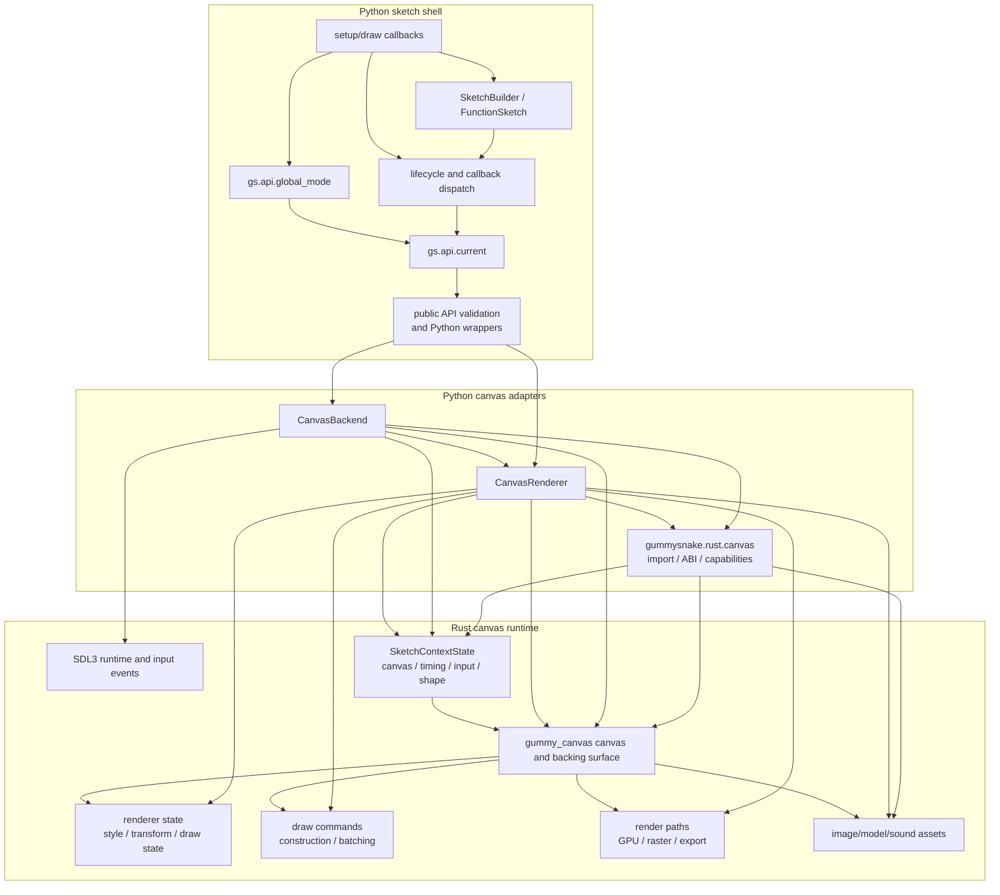
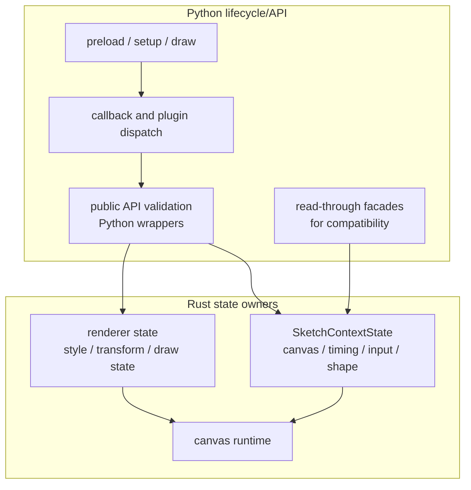
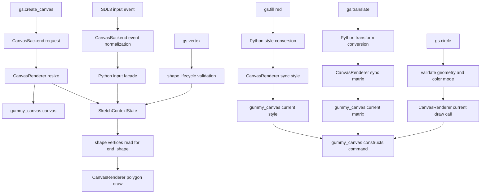
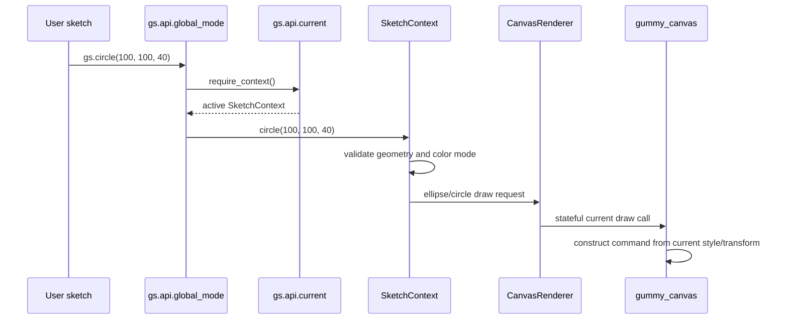

# Architecture

Gummy Snake keeps sketch semantics in Python and delegates canvas work to Rust.



## The Core Objects

The runtime has a small set of objects that appear in most changes:

| Object | File | Responsibility |
| --- | --- | --- |
| `Sketch` | `src/gummysnake/sketch/runtime.py` | Owns lifecycle ordering, callback dispatch, and the run loop entry point for object-mode sketches. Re-exported from `src/gummysnake/sketch/__init__.py`. |
| `FunctionSketch` | `src/gummysnake/sketch/runtime.py` | Wraps module-level `setup()`, `draw()`, and event callbacks so function-mode sketches use the same lifecycle as object-mode sketches. |
| `SketchBuilder` | `src/gummysnake/sketch/runtime.py` | Stores decorator-registered callbacks for `@gs.setup`, `@gs.draw`, and `@gs.on(...)` sketches. |
| `SketchContext` | `src/gummysnake/context.py` plus `src/gummysnake/_context/` mixins | Runtime controller for one sketch. It validates high-level Gummy Snake operations, calls plugins, updates Rust-owned context state through Python facades, and sends drawing work to the renderer. |
| `SketchState` | `src/gummysnake/core/state.py` | Compatibility facade for one sketch. Canvas lifecycle, timing, loop flags, input snapshots, and shape-building buffers read/write the Rust `SketchContextState`; Python still keeps API conversion state such as color mode and style objects used at the public boundary. |
| `CanvasBackend` | `src/gummysnake/backend/canvas.py` plus `src/gummysnake/backend/_canvas/backend/` mixins | Runtime adapter. It chooses headless vs interactive execution, opens native windows when supported, schedules frames, and dispatches input events. |
| `CanvasRenderer` | `src/gummysnake/backend/canvas_renderer.py` plus `src/gummysnake/backend/_canvas/renderer/` mixins | Drawing adapter. It mirrors canvas dimensions, synchronizes Python facade state mutations into Rust current state, and forwards drawing requests to the Rust canvas runtime. |
| `gummysnake.rust.canvas` | `src/gummysnake/rust/canvas.py` | Import, ABI validation, health-check, and capability wrapper for the PyO3 runtime module. It turns missing native support into clear Gummy Snake errors. |
| `gummy_canvas` | `crates/gummy_canvas/` | Required Rust canvas runtime and renderer implementation. |

## Ownership Boundaries

Python owns:

- public API naming and validation
- `setup()`, `draw()`, and callback ordering
- global-mode context activation
- callback/plugin orchestration and public API conversion state
- backend and renderer adapter contracts

Rust owns:

- canvas allocation and drawing
- renderer current style, transform stack, command construction, and batching
- presentation and export
- image asset loading, saving, and image-local byte processing
- OBJ model parsing, primitive model generation, direct projection/export, and
  Rust-owned 3D model/mesh asset data
- software-3D projection/shading/rasterization and direct GPU triangle
  submission for untextured shaded faces when available
- sound asset bytes and metadata
- text, pixels, and readback
- GPU command encoding, including primitive and image/text pipeline switching
- SDL3-backed native window and input events when compiled with those capabilities
- `SketchContextState` for canvas lifecycle fields, timing, loop/redraw flags,
  input snapshots, and shape-building buffers

## Sketch, Context, and State

These names are close enough to be confusing:

- `Sketch` is the user-program object and lifecycle owner.
- `SketchContext` is the active runtime controller for that sketch.
- `SketchState` is the Python compatibility facade over Rust-owned context
  state plus Python-only API conversion state.

The implementation still has Python classes with those names, but ownership
looks like this:



`SketchContext` methods are where most Gummy Snake semantics live. For example,
`SketchContext.rect()` resolves the current rectangle mode and style before
asking the renderer to draw. `SketchState` does not draw and does not validate
public API calls; it exposes Python-facing accessors over Rust context state and
keeps Python-only conversion state.

## What Sketch State Means

`SketchState` is now a facade rather than the authoritative runtime store. It is
not the sketch object itself, and it is not the Rust canvas. Canvas dimensions,
pixel density, renderer mode, created state, frame counters, loop/redraw flags,
mouse/keyboard/touch snapshots, and in-progress shape buffers live in the Rust
`SketchContextState` exposed by `gummysnake.rust._canvas`.

Python still owns the API-level objects and conversions that are naturally
Pythonic: color mode conversion, public style objects, font wrappers, matrix
objects used by validation helpers, callback/plugin orchestration, and public
exception policy. The renderer's authoritative current style, transform,
image/text state, draw-command construction, and batching live inside
`gummy_canvas`.

For example:

```python
gs.fill(255, 0, 0)
gs.no_stroke()
gs.circle(100, 100, 40)
```

`fill()` and `no_stroke()` update the Python public style object used for API
conversion and synchronize the Rust canvas current style. When `circle()` runs,
`SketchContext` validates geometry and color-mode semantics, then asks
`CanvasRenderer` to issue a stateful Rust draw call using the Rust-owned current
style and transform.

`SketchState` is defined in `src/gummysnake/core/state.py` and exposes:

- `canvas`: logical size, physical size, pixel density, renderer kind, and
  whether a canvas has been created, backed by Rust `SketchContextState`.
- `color_mode`: current RGB, HSB, or HSL interpretation and channel ranges.
- `style`: fill, stroke, stroke weight, text style, image mode, blend mode, and
  related Python API conversion settings synchronized into Rust renderer state.
- `transform`: the current 2D transform matrix.
- `shape`: read-through access to Rust-owned `begin_shape()` / `end_shape()`
  capture buffers.
- `timing`: Rust-owned `frame_count`, `delta_time`, target frame rate, and
  elapsed time.
- `input`: Rust-owned current mouse, keyboard, and touch values.
- `looping` and `redraw_requested`: Rust-owned frame scheduling flags.



## Public API Call Flow

Global-mode functions are thin wrappers around the active context. A call such
as `gs.circle(100, 100, 40)` follows this path:



This is why public API functions should stay small. If a function needs Gummy Snake
semantics, validation, state changes, or renderer calls, that logic usually
belongs on `SketchContext`.

## Where To Make A Change

Use these rules of thumb:

- Add or expose a public function in the topic-specific modules under
  `src/gummysnake/api/global_mode/`, wire higher-level API helpers in
  `src/gummysnake/api/` when needed, and keep `src/gummysnake/__init__.py`
  explicit imports and `__all__` entries in sync.
- Implement sketch behavior in `SketchContext` when it depends on current Gummy Snake
  state.
- Add persistent mutable sketch/runtime values to Rust `SketchContextState`
  when they must survive across API calls or frames. Add Python facade
  properties only for public readback or API conversion.
- Add one-frame temporary values to `SketchContext` when they are not part of
  the public Gummy Snake state model.
- Change `CanvasRenderer` or its mixins in
  `src/gummysnake/backend/_canvas/renderer/` when the Python side already knows
  what should be drawn and only needs to translate the request for Rust.
- Change `CanvasBackend` or its mixins in
  `src/gummysnake/backend/_canvas/backend/` when the behavior is about windows,
  scheduling, headless vs interactive mode, event polling, or shutdown.
- Change `gummysnake.rust.canvas` when import/capability errors need to be clearer.
- Change `crates/gummy_canvas` when the renderer/runtime itself lacks a primitive,
  export behavior, asset operation, or native event behavior.

## Source Map

- `src/gummysnake/api/`: public entry points, split global-mode modules, current-context access, and facade helpers.
- `src/gummysnake/_context/`: method mixins that compose `SketchContext` by concern: canvas, input, images, pixels, shapes, style, text, transforms, and 3D.
- `src/gummysnake/assets/`: image package, text/font helpers, data/model/shader/sound assets, and optional media helpers.
- `src/gummysnake/backend/`: backend contracts, registry, public canvas facade classes, and nested canvas implementation mixins.
- `src/gummysnake/constants/`: enum-backed public constants and compatibility aliases.
- `src/gummysnake/context.py`: `SketchContext` composition root and high-level runtime controller.
- `src/gummysnake/core/`: color, geometry, math, random/noise, state, transforms, data helpers, and vector types.
- `src/gummysnake/drawing/`: renderer protocols and software 3D helpers.
- `src/gummysnake/events/`: normalized mouse, keyboard, and touch input state.
- `src/gummysnake/pixels/`: public pixel buffer helper exports.
- `src/gummysnake/plugins/`: plugin interfaces and registry.
- `src/gummysnake/rust/`: Python wrappers around PyO3 runtime modules and Rust-backed kernels.
- `src/gummysnake/sketch/`: sketch lifecycle runtime, decorator builder, and object-mode facade.
- `crates/gummy_canvas/`: required canvas runtime.
- `crates/gummy_accel/`: optional acceleration extension.

## Public API Rule

Canonical public functions use `snake_case`. Do not add camelCase aliases for
p5.js names. Do not add browser-only API shims; implement native Gummy Snake
features or leave the name absent from public exports until the feature exists.

## Common Invariants

- A public drawing call must have an active `SketchContext`.
- `create_canvas()` must synchronize Rust `SketchContextState` with the
  renderer's logical and physical dimensions.
- `push()` / `pop()` should preserve style and transform state together.
- Headless rendering must still go through `gummy_canvas`.
- The public API should not expose `gummysnake.rust._canvas` types directly.
- Missing backend capabilities should fail with package-specific errors, not
  raw import errors or renderer exceptions.
