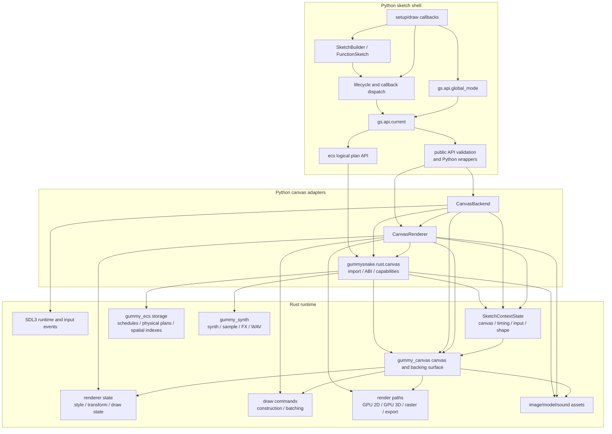
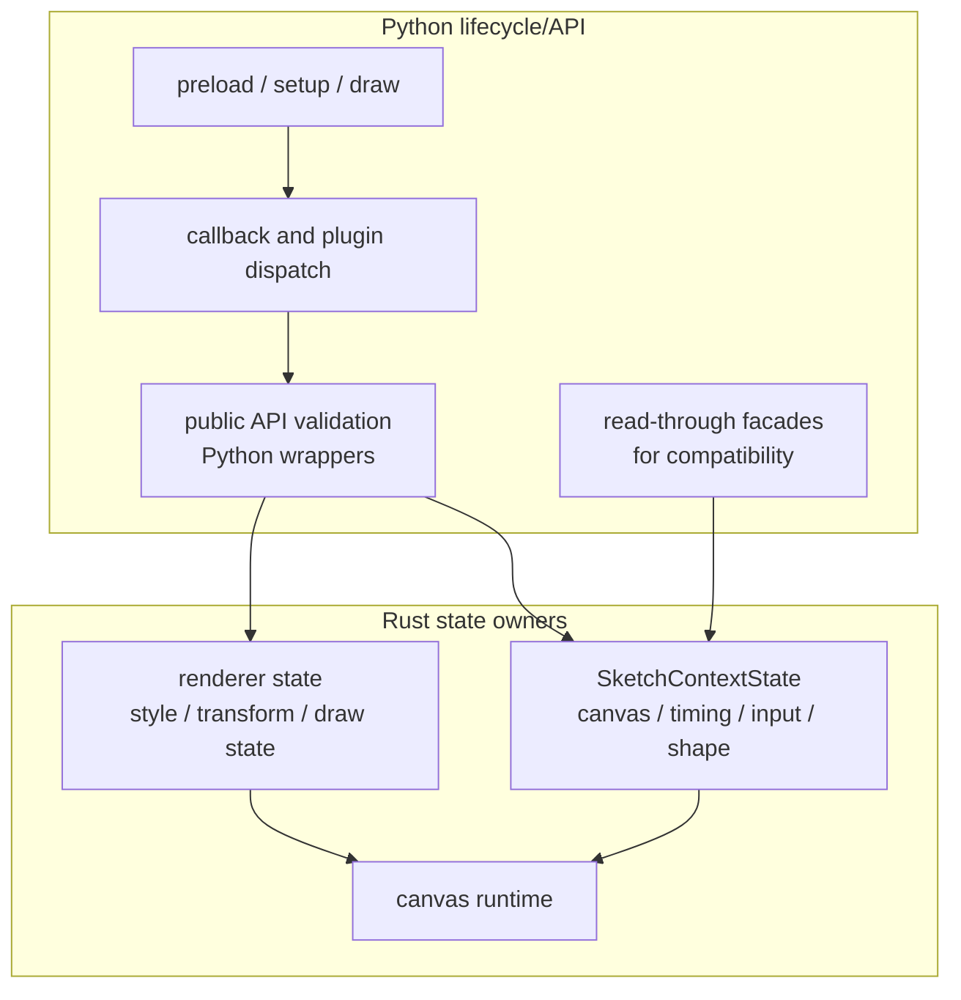
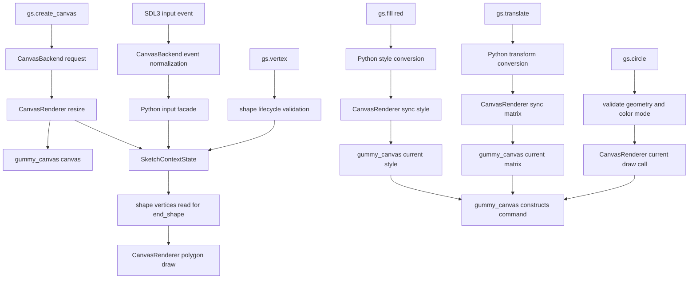
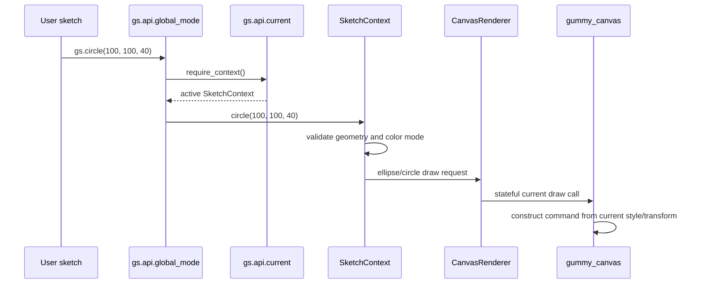

# Architecture

Gummy Snake keeps sketch semantics in Python and delegates canvas and ECS runtime
work to Rust.



## The Core Objects

The runtime has a small set of objects that appear in most changes:

| Object | File | Responsibility |
| --- | --- | --- |
| `Sketch` | `src/gummysnake/sketch/runtime.py` plus explicit forwarding groups in `src/gummysnake/sketch/facade_mixins/` | Owns lifecycle ordering, callback dispatch, and the run loop entry point for object-mode sketches. Re-exported from `src/gummysnake/sketch/__init__.py`. |
| `FunctionSketch` | `src/gummysnake/sketch/runtime.py` | Wraps module-level `setup()`, `draw()`, and event callbacks so function-mode sketches use the same lifecycle as object-mode sketches. |
| `SketchBuilder` | `src/gummysnake/sketch/runtime.py` | Stores decorator-registered callbacks for `@gs.setup`, `@gs.draw`, and `@gs.on(...)` sketches. |
| `SketchContext` | `src/gummysnake/context.py` plus `src/gummysnake/context_mixins/` mixins | Runtime controller for one sketch. It validates high-level Gummy Snake operations, calls plugins, updates Rust-owned context state through Python facades, and sends drawing work to the renderer. |
| `SketchState` | `src/gummysnake/core/state.py` | Compatibility facade for one sketch. Canvas lifecycle, timing, loop flags, input snapshots, and shape-building buffers read/write the Rust `SketchContextState`; Python still keeps API conversion state such as color mode and style objects used at the public boundary. |
| `CanvasBackend` | `src/gummysnake/backend/canvas.py` plus `src/gummysnake/backend/canvas_runtime/host/` mixins | Runtime adapter. It chooses headless vs interactive execution, opens native windows when supported, schedules frames, and dispatches input events. |
| `CanvasRenderer` | `src/gummysnake/backend/canvas_renderer.py` plus `src/gummysnake/backend/canvas_runtime/renderer/` mixins/helpers | Drawing adapter. It mirrors canvas dimensions, synchronizes Python facade state mutations into Rust current state, and forwards drawing requests to the Rust canvas runtime. Bridge, lifecycle, counters, caches, payload builders, and batch state live in focused internal modules. |
| `gummysnake.rust.canvas` | `src/gummysnake/rust/canvas.py` | Import, ABI validation, health-check, and capability wrapper for the PyO3 runtime module. It turns missing native support into clear Gummy Snake errors. |
| `gummysnake.rust.ecs` | `src/gummysnake/rust/ecs.py` | ECS ABI validation and typed wrapper around the ECS objects exposed by the mandatory canvas extension. |
| `EcsWorld` | `src/gummysnake/ecs/world.py` compatibility facade plus `src/gummysnake/ecs/world_facade/` implementation | Python-facing ECS facade. The compatibility module preserves imports; `world_facade/` validates schemas, registers systems/resources/events, and delegates canonical storage and physical execution to Rust. |
| `gummy_ecs` | `crates/gummy_ecs/` | Rust ECS storage, scheduler, physical-plan, event, resource, and spatial-index implementation. |
| `gummy_synth` | `crates/gummy_synth/` | Rust synth/sample/FX renderer used by logical synth tracks and registered through the canvas PyO3 module. |
| `gummy_canvas` | `crates/gummy_canvas/` | Required Rust canvas runtime, renderer implementation, and PyO3 bridge exposing canvas plus ECS and synth runtime functions. |

## Ownership Boundaries

Python owns:

- public API naming and validation
- `setup()`, `draw()`, and callback ordering
- global-mode context activation
- callback/plugin orchestration and public API conversion state
- backend and renderer adapter contracts
- ECS dataclass schema discovery, logical action/expression construction, explicit
  UDF calls, and user-facing entity/resource views

Rust owns:

- canvas allocation and drawing
- renderer current style, transform stack, command construction, and batching
- presentation and export
- image asset loading, saving, and image-local byte processing
- OBJ model parsing, primitive model generation, direct projection/export, and
  Rust-owned 3D model/mesh asset data
- GPU-ready model triangle packing, retained model vertex/index buffers,
  built-in 3D material/texture pipelines, GPU transform/projection, and GPU
  depth testing when GPU drawing is available
- fallback software-3D projection/shading/rasterization for unsupported or
  CPU-only paths
- direct finalization of Rust-captured shape buffers into draw and clip commands
- buffer-protocol pixel uploads and dirty row-aligned pixel region updates
- sound asset bytes and metadata
- text, pixels, and readback
- GPU command encoding, reusable vertex and instance buffers, mixed primitive
  batches, transformed sprite atlas batches, batched cached-text atlas fallback,
  procedural primitive batches, retained command-stream reuse, and
  primitive/image/text pipeline switching
- SDL3-backed native window and input events when compiled with those capabilities
- `SketchContextState` for canvas lifecycle fields, timing, loop/redraw flags,
  input snapshots, and shape-building buffers
- canonical ECS entity/component/tag/resource/event storage, deterministic query
  matching, compiled physical plans, system execution, and spatial indexes

See [ECS architecture](ecs_architecture.md) for the ECS-specific ownership and
execution model. The key rule is that Python builds logical ECS plans while Rust
owns component columns and non-UDF execution; Python must not maintain a mirror
of ECS data for performance paths.

## Sketch, Context, and State

These names are close enough to be confusing:

- `Sketch` is the user-program object and lifecycle owner.
- `SketchContext` is the active runtime controller for that sketch.
- `SketchState` is the Python compatibility facade over Rust-owned context
  state plus Python-only API conversion state.

The implementation still has Python classes with those names, but ownership
looks like this:



`SketchContext` methods are where most Gummy Snake semantics live. For example,
`SketchContext.rect()` resolves the current rectangle mode and style before
asking the renderer to draw. `SketchState` does not draw and does not validate
public API calls; it exposes Python-facing accessors over Rust context state and
keeps Python-only conversion state.

## What Sketch State Means

`SketchState` is now a facade rather than the authoritative runtime store. It is
not the sketch object itself, and it is not the Rust canvas. Canvas dimensions,
pixel density, renderer mode, created state, frame counters, loop/redraw flags,
mouse/keyboard/touch snapshots, and in-progress shape buffers live in the Rust
`SketchContextState` exposed by `gummysnake.rust._canvas`.

Python still owns the API-level objects and conversions that are naturally
Pythonic: color mode conversion, public style objects, font wrappers, matrix
objects used by validation helpers, callback/plugin orchestration, and public
exception policy. The renderer's authoritative current style, transform,
image/text state, draw-command construction, and batching live inside
`gummy_canvas`.

For example:

```python
gs.fill(255, 0, 0)
gs.no_stroke()
gs.circle(100, 100, 40)
```

`fill()` and `no_stroke()` update the Python public style object used for API
conversion and synchronize the Rust canvas current style. When `circle()` runs,
`SketchContext` validates geometry and color-mode semantics, then asks
`CanvasRenderer` to issue a stateful Rust draw call using the Rust-owned current
style and transform.

`SketchState` is defined in `src/gummysnake/core/state.py` and exposes:

- `canvas`: logical size, physical size, pixel density, renderer kind, and
  whether a canvas has been created, backed by Rust `SketchContextState`.
- `color_mode`: current RGB, HSB, or HSL interpretation and channel ranges.
- `style`: fill, stroke, stroke weight, text style, image mode, blend mode, and
  related Python API conversion settings synchronized into Rust renderer state.
- `transform`: the current 2D transform matrix.
- `shape`: read-through access to Rust-owned `begin_shape()` / `end_shape()`
  capture buffers.
- `timing`: Rust-owned `frame_count`, `delta_time`, target frame rate, and
  elapsed time.
- `input`: Rust-owned current mouse, keyboard, and touch values.
- `looping` and `redraw_requested`: Rust-owned frame scheduling flags.



## Public API Call Flow

Global-mode functions are thin wrappers around the active context. A call such
as `gs.circle(100, 100, 40)` follows this path:



This is why public API functions should stay small. If a function needs Gummy Snake
semantics, validation, state changes, or renderer calls, that logic usually
belongs on `SketchContext`.

Canvas frames use a unified Rust-owned command stream before final output.
Headless and native interactive runs append the same typed draw commands into
the canvas runtime, encode them into the same offscreen render target, and
branch only at the output boundary: readback/export for headless diagnostics or
texture-to-surface presentation for native windows. Text, image, primitive,
blend/effect, pixel, and 3D commands are segmented inside the Rust encoder so
pipeline switches preserve visible draw order.

## Where To Make A Change

Use these rules of thumb:

- Add or expose a public function in the topic-specific modules under
  `src/gummysnake/api/global_mode/`, wire higher-level API helpers in
  `src/gummysnake/api/` when needed, and keep `src/gummysnake/__init__.py`
  explicit imports and `__all__` entries in sync.
- Implement sketch behavior in `SketchContext` when it depends on current Gummy Snake
  state.
- Add persistent mutable sketch/runtime values to Rust `SketchContextState`
  when they must survive across API calls or frames. Add Python facade
  properties only for public readback or API conversion.
- Add one-frame temporary values to `SketchContext` when they are not part of
  the public Gummy Snake state model.
- Change `CanvasRenderer` or its mixins in
  `src/gummysnake/backend/canvas_runtime/renderer/` when the Python side already knows
  what should be drawn and only needs to translate the request for Rust.
- Change `CanvasBackend` or its mixins in
  `src/gummysnake/backend/canvas_runtime/host/` when the behavior is about windows,
  scheduling, headless vs interactive mode, event polling, or shutdown.
- Change `gummysnake.rust.canvas` when import/capability errors need to be clearer.
- Change `crates/gummy_canvas` when the renderer/runtime itself lacks a primitive,
  export behavior, asset operation, or native event behavior.
- Change `crates/gummy_synth` when synth tracks need a new synth waveform,
  sample decoder, FX implementation, or audio render behavior.

## Source Map

- `src/gummysnake/api/`: public entry points grouped by topic (`lifecycle`,
  `environment`, `timing`, `input`, `images`, `pixels`, `text`, `compositing`,
  `media`, `models`, `shaders`, `sound`, `three_d`), split global-mode modules,
  current-context access, and compatibility facades.
- `src/gummysnake/context_mixins/`: method mixins that compose `SketchContext` by
  concern: canvas, input, images, pixels, shapes, style, text, transforms, and 3D.
- `src/gummysnake/assets/`: image package (`assets/image/core.py` owns the public
  `Image` class), text/font helpers, data/model/shader/sound assets, and optional
  media helpers.
- `src/gummysnake/backend/`: backend contracts, registry, public canvas facade
  classes, and canvas runtime implementation packages. Backend/runtime helpers
  live under `backend/canvas_runtime/host/`; renderer internals live under
  `backend/canvas_runtime/renderer/` and are split into bridge, lifecycle,
  counters, caches, payload builders, primitive batch state, and drawing concern
  modules.
- `src/gummysnake/constants/`: enum-backed public constants and compatibility
  aliases.
- `src/gummysnake/context.py`: `SketchContext` composition root and high-level
  runtime controller.
- `src/gummysnake/core/`: color, geometry, math, random/noise, pixel buffer
  helpers (`core/pixels.py`), input event dataclasses (`core/input_events.py`),
  state, `state_facades`, transforms, data helpers, and vector types.
- `src/gummysnake/drawing/`: renderer protocols, the `renderer3d` package,
  `software3d` helpers, and retained `prototype3d` compatibility/prototype
  helpers.
- `src/gummysnake/plugins/`: plugin interfaces and registry.
- `src/gummysnake/rust/`: Python wrappers around PyO3 runtime modules and
  Rust-backed kernels.
- `src/gummysnake/sketch/`: sketch lifecycle runtime, decorator builder, and
  object-mode facade. Object-mode forwarding methods are grouped explicitly under
  `src/gummysnake/sketch/facade_mixins/` instead of using dynamic forwarding
  magic.
- `tests/unit/`: focused subsystem packages for API/lifecycle, assets/media,
  canvas runtime, ECS, synth, 3D, and tooling coverage.
- `tests/helpers/`: reusable canvas fakes under `canvas_runtime/`, plus shared
  ECS, synth, renderer, and WEBGL helper objects used across unit/contract tests.
- `tests/fixtures/`: package-resource and file fixtures used by tests.
- `examples/output/`: ignored generated output from examples; do not treat it as
  source.
- `crates/gummy_canvas/`: required canvas runtime. Canvas helpers include cache
  policy (`canvas/cache.rs`), dirty/render flag helpers (`canvas/dirty.rs`), image
  batch parsing (`canvas/images/batch.rs`), text layout helpers
  (`canvas/text/layout.rs`), and local GPU render-pass batching
  (`gpu/render/batching/`). `gpu/renderer_state.rs` owns the renderer resource
  graph, while `gpu/types.rs` remains focused on draw, uniform, and vertex POD
  records. Its focused `bindings/synth.rs` adapter owns PyO3 parsing,
  registration, and Python error conversion for the synth functions linked from
  `gummy_synth`.
- `crates/gummy_synth/`: PyO3-free Rust synth/sample/FX rendering crate used by
  `gummysnake.synth` physical-plan playback/export through the canvas extension.
  Its crate root exposes typed values, `SynthError`/`SynthResult`,
  `CompiledSynthProgram`, the stateful block renderer, causal normaliser, and
  plan rendering; `types.rs`, `plans.rs`, `playback.rs`, synth/voice modules,
  `samples.rs`, FX-family modules, `dsp.rs`, `output.rs`, `executor.rs`,
  and concern-based `tests/` own the corresponding audio domains. `executor.rs`
  owns the single bounded persistent offline worker pool, stable indexed dry-event
  regions, worker configuration, scratch limits, and synth execution diagnostics.
  Serialized plan header/schema/compression and WAV output are compatibility
  contracts; this crate has no Python or alternate-renderer fallback. The canvas
  PyO3 adapter validates/copies Python inputs before releasing the GIL around
  Rust-owned compile/render/decode/WAV work. `gummy_canvas::sound` owns one
  process-local SDL3 device thread and deterministic mixer for immutable
  `CanvasSound` assets and stateful synth sessions; it does not parse synth plans
  or execute Python in the audio thread.
- `crates/gummy_accel/`: optional acceleration extension.

## Naming And Layout Conventions

- Public Python APIs and docs use `snake_case`. Public 3D API/doc identifiers use
  `three_d` where a Python name is needed. Existing compatibility import paths
  such as `gummysnake.drawing.renderer3d` and `gummysnake.drawing.software3d`
  keep their `3d` spelling because user/tests may import those modules directly.
- Avoid adjacent Python module/package pairs such as `foo.py` plus `_foo/`, and
  avoid ambiguous `foo.py` plus `foo/`. Prefer one descriptive package such as
  `context_mixins`, `facade_mixins`, `state_facades`, or
  `canvas_runtime/renderer`.
- Use `mixins` only for modules whose classes are composed into a public root
  class. Use `facades` for compatibility/export/property-forwarding surfaces.
  Use `runtime`, `host`, and `renderer` for backend/runtime implementation
  boundaries rather than generic support-package names.
- Test-only resources belong under `tests/fixtures/`; shared test fakes/helpers
  belong under `tests/helpers/`. Do not add package-resource fixtures under
  `src/gummysnake`.
- Rust may use same-stem `foo.rs` hub files with `foo/` child modules when the
  file is an intentional declaration/re-export boundary. Current documented hubs
  are `bindings.rs`, `bindings/ecs.rs`, `bindings/models.rs`, `canvas/gpu.rs`,
  `canvas/gpu/shapes.rs`, `canvas/lifecycle.rs`, `canvas/pixels.rs`, `canvas/primitives.rs`,
  `canvas/primitives/batches.rs`, `gpu/pipeline.rs`,
  `gpu/render.rs`, `gpu/setup.rs`, `gpu/shaders.rs`,
  `gpu/shaders/primitive.rs`, `gpu/types.rs`, `runtime/desktop.rs`,
  `sketch_state.rs`, `sound.rs`, and `tests.rs` under
  `crates/gummy_canvas/src/`, plus `execution.rs`,
  `execution/interpreter/actions.rs`, `execution/optimized/f64_program.rs`,
  `execution/row_local/compact_fill.rs`, `execution/tests.rs`, `plan.rs`,
  `spatial.rs`, `spatial/hash_grid.rs`, `spatial/tree_spatial.rs`, and
  `world.rs` under `crates/gummy_ecs/src/`.
- Run `uv run python scripts/structure_audit.py` after layout changes. It checks
  for confusing Python sibling module/package patterns, source-package test
  fixtures, stale renamed package references, generated example output policy,
  and undocumented or stale Rust same-stem hubs across every Cargo workspace
  member.
- Run `uv run python scripts/source_size_audit.py` after source splits or large
  refactors to report implementation files over the 300-counted-line review
  threshold while excluding import/export barrels such as
  `src/gummysnake/__init__.py`. Run
  `uv run python scripts/source_size_audit.py --check` (or `make audit`) before
  merging a layout change; it enforces reviewed 500-line limits across all
  Python and Cargo-workspace production roots.

## Public API Rule

Canonical public functions use `snake_case`. Do not add camelCase aliases for
p5.js names. Do not add browser-only API shims; implement native Gummy Snake
features or leave the name absent from public exports until the feature exists.

## Common Invariants

- A public drawing call must have an active `SketchContext`.
- `create_canvas()` must synchronize Rust `SketchContextState` with the
  renderer's logical and physical dimensions.
- `push()` / `pop()` should preserve style and transform state together.
- Headless rendering must still go through `gummy_canvas`.
- The public API should not expose `gummysnake.rust._canvas` types directly.
- Missing backend capabilities should fail with package-specific errors, not
  raw import errors or renderer exceptions.
