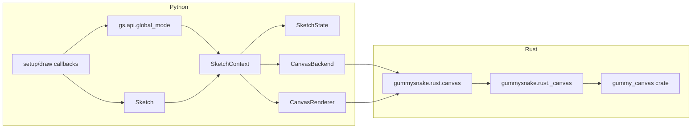
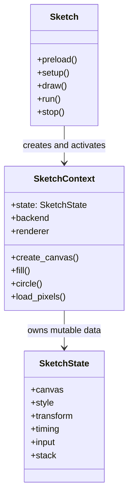
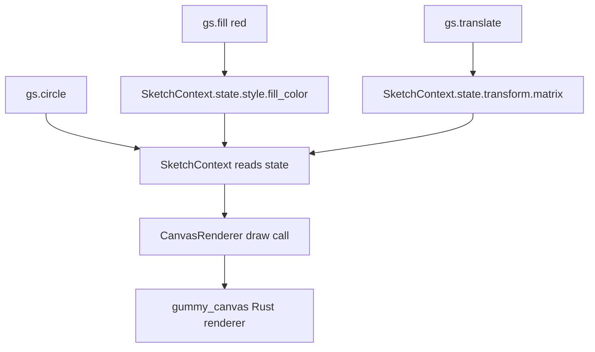
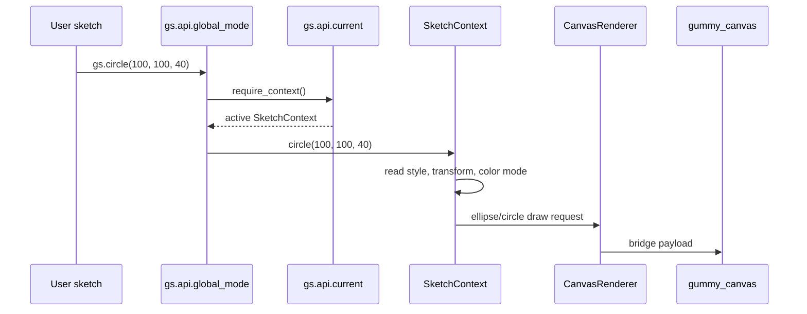

# Architecture

Gummy Snake keeps sketch semantics in Python and delegates canvas work to Rust.



## The Core Objects

The runtime has a small set of objects that appear in most changes:

| Object | File | Responsibility |
| --- | --- | --- |
| `Sketch` | `src/gummysnake/sketch.py` | Owns lifecycle ordering, callback dispatch, and the run loop entry point for class-mode sketches. |
| `FunctionSketch` | `src/gummysnake/sketch.py` | Wraps module-level `setup()`, `draw()`, and event callbacks so function-mode sketches use the same lifecycle as class-mode sketches. |
| `SketchContext` | `src/gummysnake/context.py` | Runtime controller for one sketch. It validates high-level Gummy Snake operations, updates `SketchState`, calls plugins, and sends drawing work to the renderer. |
| `SketchState` | `src/gummysnake/core/state.py` | Mutable data for one sketch: canvas dimensions, style, transforms, timing, input, shape-building state, and lifecycle flags. |
| `CanvasBackend` | `src/gummysnake/backends/canvas.py` | Runtime adapter. It chooses headless vs interactive execution, opens native windows when supported, schedules frames, and dispatches input events. |
| `CanvasRenderer` | `src/gummysnake/backends/canvas_renderer.py` | Drawing adapter. It translates Python state and drawing requests into payloads understood by the Rust canvas extension. |
| `gummysnake.rust.canvas` | `src/gummysnake/rust/canvas.py` | Import and capability wrapper for the PyO3 extension. It turns missing native support into clear Gummy Snake errors. |
| `gummy_canvas` | `crates/gummy_canvas/` | Required Rust canvas runtime and renderer implementation. |

## Ownership Boundaries

Python owns:

- public API naming and validation
- `setup()`, `draw()`, and callback ordering
- global-mode context activation
- sketch state, style state, transforms, and plugin hooks
- backend and renderer adapter contracts

Rust owns:

- canvas allocation and drawing
- presentation and export
- image asset loading and saving
- text, pixels, and readback
- native window and input events when compiled with those capabilities

## Sketch, Context, and State

These names are close enough to be confusing:

- `Sketch` is the user-program object and lifecycle owner.
- `SketchContext` is the active runtime controller for that sketch.
- `SketchState` is the mutable data inside the context.

In code, that relationship looks like this:



`SketchContext` methods are where most Gummy Snake semantics live. For example,
`SketchContext.rect()` resolves the current rectangle mode and style before
asking the renderer to draw. `SketchState` does not draw and does not validate
public API calls; it only stores the values those methods need.

## What Sketch State Means

`SketchState` is the mutable Python data model for one running sketch. It is not
the sketch object itself, and it is not the Rust canvas. It is the place where
Gummy Snake stores the current Gummy Snake-style settings that affect later API calls.

For example:

```python
gs.fill(255, 0, 0)
gs.no_stroke()
gs.circle(100, 100, 40)
```

`fill()` and `no_stroke()` update `SketchContext.state.style`. When `circle()`
runs, `SketchContext` reads that style state, combines it with the current
transform and color mode, and asks `CanvasRenderer` to draw the circle.

`SketchState` is defined in `src/gummysnake/core/state.py` and contains:

- `canvas`: logical size, physical size, pixel density, renderer kind, and
  whether a canvas has been created.
- `color_mode`: current RGB, HSB, or HSL interpretation and channel ranges.
- `style`: fill, stroke, stroke weight, text style, image mode, blend mode, and
  related drawing settings.
- `transform`: the current 2D transform matrix.
- `shape`: temporary vertices while `begin_shape()` / `end_shape()` is active.
- `timing`: `frame_count`, `delta_time`, target frame rate, and elapsed time.
- `input`: current mouse, keyboard, and touch values.
- `stack`: saved style and transform entries for `push()` / `pop()`.
- `looping` and `redraw_requested`: frame scheduling flags.



## Public API Call Flow

Global-mode functions are thin wrappers around the active context. A call such
as `gs.circle(100, 100, 40)` follows this path:



This is why public API functions should stay small. If a function needs Gummy Snake
semantics, validation, state changes, or renderer calls, that logic usually
belongs on `SketchContext`.

## Where To Make A Change

Use these rules of thumb:

- Add or expose a public function in `src/gummysnake/api/global_mode.py` and
  `src/gummysnake/__init__.py`.
- Implement sketch behavior in `SketchContext` when it depends on current Gummy Snake
  state.
- Add persistent current values to `SketchState` when they must survive across
  API calls or frames.
- Add one-frame temporary values to `SketchContext` when they are not part of
  the public Gummy Snake state model.
- Change `CanvasRenderer` when the Python side already knows what should be
  drawn and only needs to translate the request for Rust.
- Change `CanvasBackend` when the behavior is about windows, scheduling,
  headless vs interactive mode, event polling, or shutdown.
- Change `gummysnake.rust.canvas` when import/capability errors need to be clearer.
- Change `crates/gummy_canvas` when the renderer/runtime itself lacks a primitive,
  export behavior, asset operation, or native event behavior.

## Source Map

- `src/gummysnake/api/`: global-mode APIs and compatibility stubs.
- `src/gummysnake/sketch.py`: sketch lifecycle and callback dispatch.
- `src/gummysnake/context.py`: mutable sketch state and high-level drawing behavior.
- `src/gummysnake/backends/`: runtime and renderer adapters.
- `src/gummysnake/rust/`: Python wrappers around PyO3 extensions.
- `crates/gummy_canvas/`: required canvas runtime.
- `crates/gummy_accel/`: optional acceleration extension.

## Public API Rule

Canonical public functions use `snake_case`. Do not add camelCase aliases for
p5.js names. Unsupported browser-only APIs should raise explicit Gummy Snake exceptions,
usually `UnsupportedFeatureError` or `BackendCapabilityError`.

## Common Invariants

- A public drawing call must have an active `SketchContext`.
- `create_canvas()` must keep `SketchState.canvas` synchronized with the
  renderer's logical and physical dimensions.
- `push()` / `pop()` should preserve style and transform state together.
- Headless rendering must still go through `gummy_canvas`.
- The public API should not expose `gummysnake.rust._canvas` types directly.
- Missing backend capabilities should fail with package-specific errors, not
  raw import errors or renderer exceptions.
