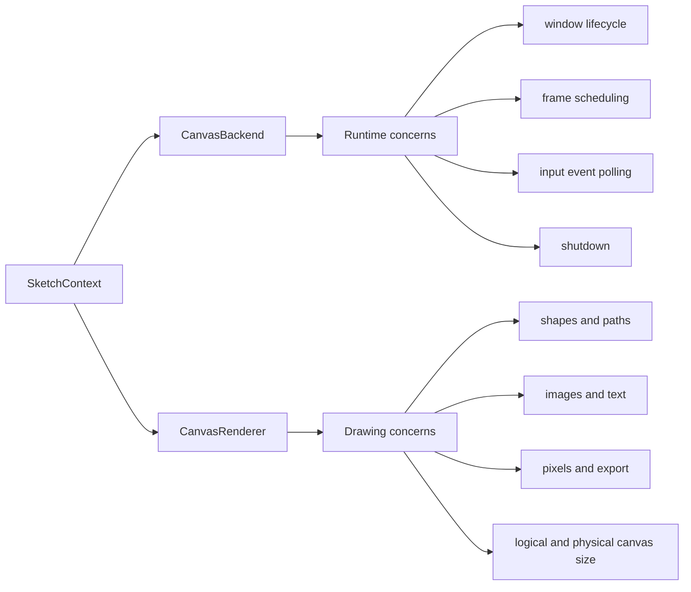
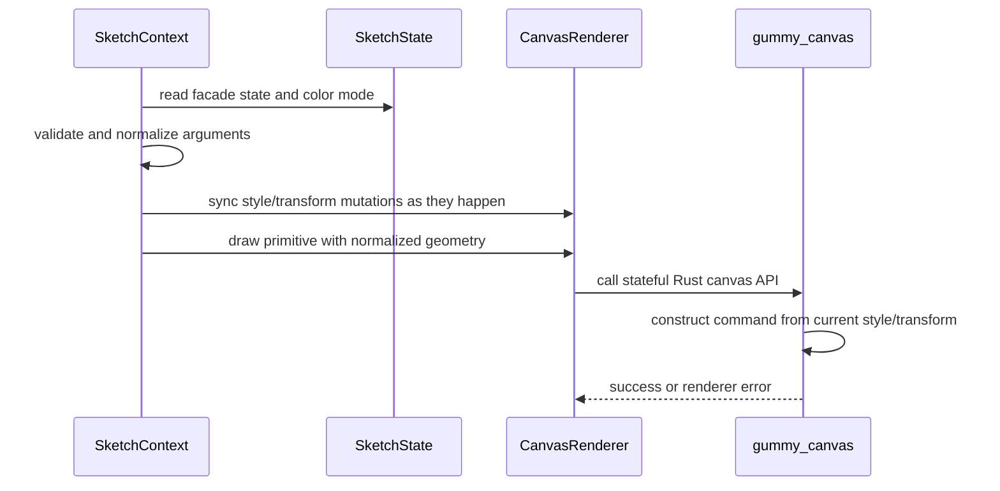

# Backend and Renderer Boundaries

The backend and renderer are intentionally separate because they solve different
problems.

## CanvasBackend

`CanvasBackend` is the adapter for runtime concerns. Its public composition root
is `src/gummysnake/backend/canvas.py`; the refactored implementation lives in
focused mixins under `src/gummysnake/backend/_canvas/backend/` for runtime,
events, and frame pacing behavior. It does not decide Gummy Snake API naming
policy and should not contain drawing semantics such as how `rect_mode()`
changes a rectangle.

It is responsible for:

- constructing and owning the `CanvasRenderer`
- checking whether native interactive mode is available
- creating and resizing the canvas through the renderer
- choosing bounded headless execution or interactive execution
- opening SDL3-backed native windows when supported
- scheduling frames at the requested frame rate
- polling Rust-originated input events
- normalizing SDL3 mouse, keyboard, and touch events for `SketchContext`
- stopping and closing renderer resources

Most changes to `CanvasBackend` should be covered by contract tests or focused
unit tests with fake canvas modules/events. SDL3 pointer/touch events are already
logical window coordinates, so backend normalization must respect
`coordinates = "logical"` payloads and avoid applying pixel-density scaling a
second time.

## CanvasRenderer

`CanvasRenderer` is the adapter for drawing concerns. Its public composition root
is `src/gummysnake/backend/canvas_renderer.py`; the refactored implementation
lives in focused mixins under `src/gummysnake/backend/_canvas/renderer/` for
core state/caches, primitives, images, pixels, and text. It should receive
already validated Gummy Snake-level decisions from `SketchContext` and translate
them into Rust canvas calls.

It is responsible for:

- tracking logical canvas dimensions
- tracking physical backing-buffer dimensions
- tracking pixel density
- synchronizing Python facade style/transform changes into the Rust canvas state
- forwarding primitive drawing to the Rust canvas runtime
- reading and updating physical RGBA pixel buffers
- exporting the canvas
- closing runtime canvas resources

Renderer methods should not know about global-mode dispatch, plugin hooks, or
the sketch lifecycle. The Rust renderer may batch and reorder internally only
where observable draw order is preserved. Mixed primitive and image/text GPU
commands must flush batches and restore the correct pipeline/bind groups when
switching command families.

The current canvas drawing boundary is stateful. `SketchContext` still validates
Gummy Snake semantics and keeps Python-facing mirrors for public readbacks,
argument normalization, and features such as `rect_mode()`. `gummy_canvas`
owns the mutable renderer state used to construct draw commands: current style,
current transform matrix, push/pop drawing state, image/text draw state, and
batching state. New drawing operations should prefer Rust `*_current` methods
that consume the Rust-owned current style and matrix instead of rebuilding a
full Python style/matrix payload per command. Legacy payload-style methods may
remain as compatibility shims for tests and staged migrations, but they should
not become the primary path for new renderer work.

## gummysnake.rust.canvas

`gummysnake.rust.canvas` is the Python wrapper around runtime import and
required runtime capability checks. The PyO3 module is required for current
runtime behavior, but imports can still fail in development environments.

This layer should:

- import `gummysnake.rust._canvas`
- expose a small health-check and capability-check surface
- raise clear Gummy Snake exceptions when the canvas runtime is missing
- include rebuild guidance in capability errors

Do not leak raw runtime import errors to sketch authors when a package-level
error would explain the problem better.

## Boundary Examples

Use these examples when deciding where code belongs:

| Change | Layer |
| --- | --- |
| Add a new public drawing function | topic module under `src/gummysnake/api/global_mode/`, `src/gummysnake/__init__.py`, `SketchContext` or a `src/gummysnake/_context/` mixin, and maybe `CanvasRenderer`/Rust |
| Change how `rect_mode(CENTER)` computes coordinates | `SketchContext` or geometry helpers |
| Add a new Rust primitive call | `src/gummysnake/backend/_canvas/renderer/primitives.py` and `crates/gummy_canvas`, preferably as a stateful `*_current` operation |
| Improve missing runtime or ABI error text | `gummysnake.rust.canvas` |
| Poll a new native input event | `src/gummysnake/backend/_canvas/backend/events.py` and Rust SDL3 event support |
| Add a new pixel export format | `src/gummysnake/backend/_canvas/renderer/pixels.py` and `crates/gummy_canvas` |
| Change frame scheduling | `src/gummysnake/backend/_canvas/backend/pacing.py` or `runtime.py` and lifecycle tests |
| Change GPU command batching or pipeline switching | `crates/gummy_canvas/src/gpu/` plus render-order regression tests |

## Data Flow For A Draw Call

The context owns Gummy Snake behavior. The renderer owns the Python adapter
boundary. Rust owns drawing state, command construction, batching, and actual
rendering.
