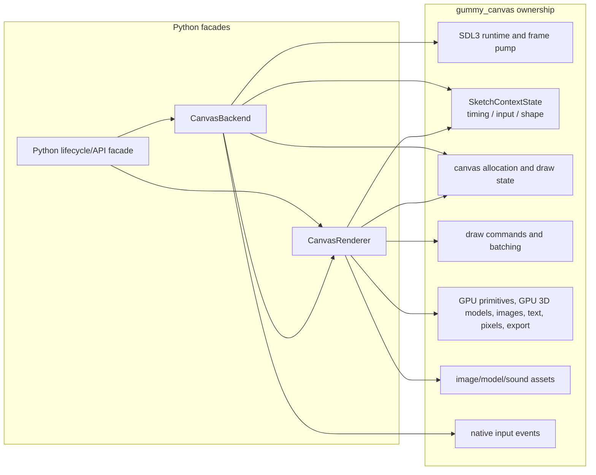
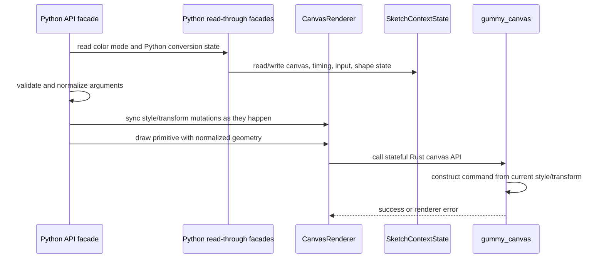

# Backend and Renderer Boundaries

The backend and renderer are intentionally separate because they solve different
problems.

## CanvasBackend

`CanvasBackend` is the adapter for runtime concerns. Its public composition root
is `src/gummysnake/backend/canvas.py`; the refactored implementation lives in
focused mixins under `src/gummysnake/backend/canvas_runtime/host/` for runtime,
events, and frame pacing behavior. It does not decide Gummy Snake API naming
policy and should not contain drawing semantics such as how `rect_mode()`
changes a rectangle.

It is responsible for:

- constructing and owning the `CanvasRenderer`
- checking whether native interactive mode is available
- requesting canvas creation and resize through the renderer
- choosing bounded headless execution or interactive execution
- opening SDL3-backed native windows when supported
- scheduling frames at the requested frame rate
- polling Rust-originated input events
- normalizing SDL3 mouse, keyboard, and touch events for `SketchContext`
- stopping and closing renderer resources

Most changes to `CanvasBackend` should be covered by contract tests or focused
unit tests with fake canvas modules/events from `tests/helpers/canvas_runtime/`.
SDL3
pointer/touch events are already logical window coordinates, so backend
normalization must respect
`coordinates = "logical"` payloads and avoid applying pixel-density scaling a
second time.

## CanvasRenderer

`CanvasRenderer` is the adapter for drawing concerns. Its public composition root
is `src/gummysnake/backend/canvas_renderer.py`; the refactored implementation
lives in focused mixins and helpers under
`src/gummysnake/backend/canvas_runtime/renderer/` for bridge calls, lifecycle,
counters, small caches, payload builders, primitive/line batch state,
primitives, images, pixels, and text. It should receive already validated Gummy
Snake-level decisions from `SketchContext` and translate them into Rust canvas
calls.

It is responsible for:

- tracking logical canvas dimensions
- tracking physical backing-buffer dimensions
- tracking pixel density
- allocating/resizing the Rust canvas when the backend or public API requests it
- synchronizing canvas lifecycle dimensions into Rust `SketchContextState`
- synchronizing Python facade style/transform changes into the Rust canvas state
- forwarding primitive drawing to the Rust canvas runtime
- reading and updating physical RGBA pixel buffers
- exporting the canvas
- closing runtime canvas resources

Renderer methods should not know about global-mode dispatch, plugin hooks, or
the sketch lifecycle. The Rust renderer may batch and reorder internally only
where observable draw order is preserved. Mixed primitive and image/text GPU
commands must flush batches and restore the correct pipeline/bind groups when
switching command families.
Compact primitive batches may use procedural GPU instance commands for rects,
triangles, and axis-aligned ellipses/circles, and may also carry mixed
fill/stroke/line records with per-record style and transform data. Compatible
line runs and image runs may batch through compact Rust records. Ordered image
batches should carry per-record affine transforms, source rectangles, tint,
sampling, and blend state where available, and may use atlas-backed GPU draws.
Unsupported transforms must keep the general vertex path. Unchanged static
command streams may be retained and reused across frames. Text, primitives,
images, pixel effects, and blend/effect passes may be segmented internally, but
the segmentation must preserve visible draw order and keep primitives/images/text
visible after family switches. The Rust GPU encoder uses a local
`RenderPassBatcher`; if a frame is split into multiple render-pass segments, its
reusable buffer offsets must advance across the whole command encoder so later
uploads do not overwrite vertices, image records, or model uniforms referenced by
earlier passes.

The current canvas drawing boundary is stateful. `SketchContext` still validates
Gummy Snake semantics and owns Python-facing conversion objects, but mutable
canvas lifecycle fields, timing, loop flags, input snapshots, and
`begin_shape()` buffers live in Rust `SketchContextState`. `gummy_canvas` also
owns the mutable renderer state used to construct draw commands: current style,
current transform matrix, push/pop drawing state, image/text draw state, and
batching state. New drawing operations should prefer Rust `*_current` methods
that consume the Rust-owned current style and matrix instead of rebuilding a
full Python style/matrix payload per command. Legacy payload-style methods may
Legacy payload-style methods may
remain as compatibility shims for tests and staged migrations, but they should
not become the primary path for new renderer work.

### Renderer and context navigation

`canvas_renderer.py` and `canvas.py` are deliberately thin composition roots.
The renderer implementation is grouped by responsibility beneath
`backend/canvas_runtime/renderer/`; stable flat internal modules remain explicit
import shims while implementation code depends on the descriptive homes below.
This keeps established internal test imports working without creating a
same-stem module/package pair.

| Responsibility | Implementation home | Dependency direction |
| --- | --- | --- |
| Core bridge and lifecycle composition | `renderer/core.py`, `bridge.py`, `lifecycle.py` | composition calls grouped support; it does not own drawing-family policy |
| Payload, cache, batch state, and diagnostics | `renderer/renderer_state/` | state is consumed by core and drawing support only |
| Primitive batching, direct paths, clips, and shapes | `renderer/primitive_support/` | primitive mixin delegates into support, then the Rust canvas bridge |
| Pixel payloads and pixel renderer mixin | `renderer/pixel_support/` | physical RGBA buffers stay in Rust; dirty regions cross the bridge unchanged |
| Ordered image, text, primitive, and model mixins | `renderer/drawing/` | family boundaries flush prior work before invoking Rust commands |
| Context pixel and shape helpers | `context_mixins/pixel_support/`, `context_mixins/shape_support/` | stable `PixelContextMixin` / `ShapeContextMixin` expose Python semantics and call the renderer |

Do not move host responsibilities into these packages. Native event ingestion,
logical-coordinate normalization, pointer-lock control, and text-input control
remain in `backend/canvas_runtime/host/`; `context_mixins/input.py` only exposes
callback-facing state. In particular, SDL3 payloads marked
`coordinates = "logical"` must not be scaled by pixel density.

The primitive flush sequence is intentionally divided into state draining,
native payload/submission selection, counter recording, and the existing
unbatched bridge path. This separation must not alter record formats, native
batch decisions, or the counter names and values surfaced by
`renderer_performance_counters()`.

## gummysnake.rust.canvas

`gummysnake.rust.canvas` is the Python wrapper around runtime import and
required runtime capability checks. The PyO3 module is required for current
runtime behavior, but imports can still fail in development environments.

This layer should:

- import `gummysnake.rust._canvas`
- expose a small health-check and capability-check surface
- raise clear Gummy Snake exceptions when the canvas runtime is missing
- include rebuild guidance in capability errors

Do not leak raw runtime import errors to sketch authors when a package-level
error would explain the problem better.

## Boundary Examples

Use these examples when deciding where code belongs:

| Change | Layer |
| --- | --- |
| Add a new public drawing function | topic module under `src/gummysnake/api/global_mode/`, `src/gummysnake/__init__.py`, `SketchContext` or a `src/gummysnake/context_mixins/` mixin, and maybe `CanvasRenderer`/Rust |
| Change how `rect_mode(CENTER)` computes coordinates | `SketchContext` or geometry helpers |
| Add a new Rust primitive call | `src/gummysnake/backend/canvas_runtime/renderer/primitives.py` and `crates/gummy_canvas`, preferably as a stateful `*_current` operation |
| Improve missing runtime or ABI error text | `gummysnake.rust.canvas` |
| Poll a new native input event | `src/gummysnake/backend/canvas_runtime/host/events.py` and Rust SDL3 event support |
| Add a new pixel export format | `src/gummysnake/backend/canvas_runtime/renderer/pixels.py` and `crates/gummy_canvas` |
| Change frame scheduling | `src/gummysnake/backend/canvas_runtime/host/pacing.py` or `runtime.py` and lifecycle tests |
| Change GPU command batching or pipeline switching | `crates/gummy_canvas/src/gpu/` plus render-order regression tests |

## Data Flow For A Draw Call

The context owns Gummy Snake behavior. The renderer owns the Python adapter
boundary. Rust owns drawing state, command construction, batching, and actual
rendering.

For built-in `WEBGL` model draws, Python should pass Rust-owned model handles
and synchronized style/transform/camera/material state rather than projected
face payloads. The Rust canvas runtime owns retained model buffers, GPU
transform/projection, depth testing, texture sampling, and built-in material
shading when GPU drawing is available. Fallback software-3D projected
coordinates are logical canvas coordinates and must be scaled by pixel density
before any direct GPU primitive fallback submission.

Pixel update and shape paths are also part of the renderer boundary. Exact fresh
pixel-byte re-uploads should be skipped, dirty `PixelBuffer` ranges should use
bounded Rust region uploads where possible, and captured `begin_shape()` buffers
should finalize directly into Rust draw/clip commands instead of being
materialized as Python vertex lists on normal paths.
