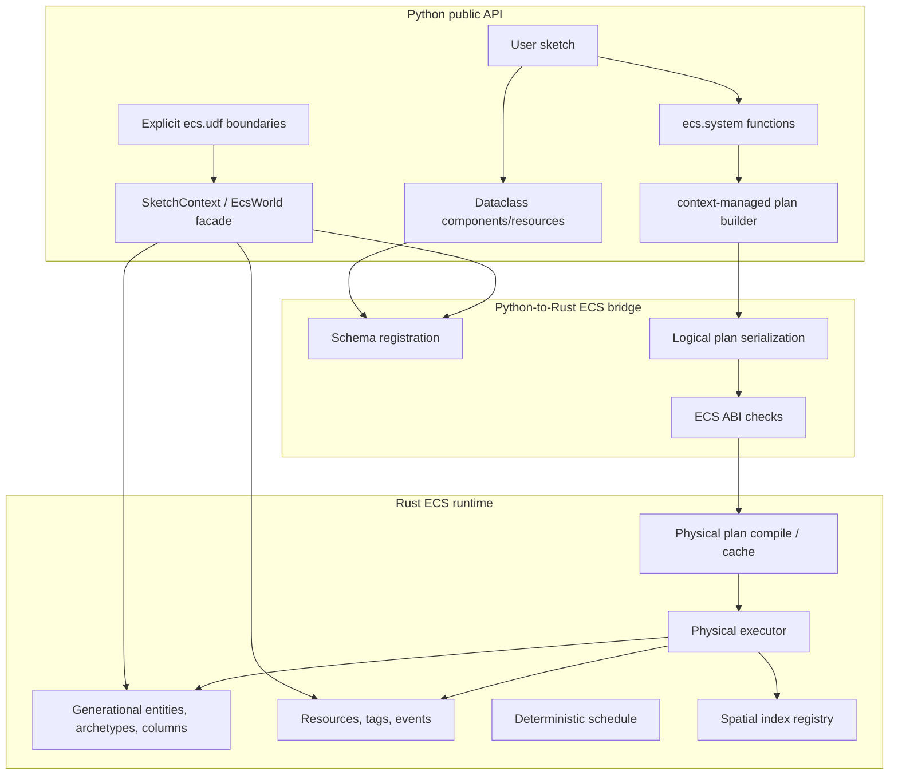

# ECS Architecture

Gummy Snake's ECS is a Pythonic logical-plan API backed by Rust-owned storage and
physical execution. The public surface is designed to feel like typed Python data
workflows: dataclass components behave like tables/columns, query expressions
compose into lazy plans, and decorated systems record action trees through
context-managed build sessions rather than running Python loops over component
data.

## High-level shape



Python owns API naming, annotations, validation, dataclass schema discovery,
logical-plan construction, explicit UDF invocation, and friendly entity/resource
views. Rust owns canonical entity/component/tag/resource/event storage, query
matching, spatial indexes, compiled physical plans, and non-UDF system execution.
Do not add a Python mirror of component columns or a Python runtime fallback for
non-UDF systems.

## Source map

| Area | Path | Responsibility |
| --- | --- | --- |
| Public ECS exports | `src/gummysnake/ecs/__init__.py` | Explicit user-facing ECS names. |
| Context/global/object APIs | `src/gummysnake/api/ecs.py`, `src/gummysnake/context_mixins/ecs.py`, `src/gummysnake/sketch/facade_mixins/ecs.py` | `gs.add_entity`, `gs.add_system`, resources, events, diagnostics, object-mode forwards. |
| Logical expressions | `src/gummysnake/ecs/expressions.py` | Lazy arithmetic, boolean, function, field, grouped aggregate, exists, input-state expressions. |
| Actions/UDFs/events | `src/gummysnake/ecs/actions.py` | `Action`, `when`, `otherwise`, `do_in_order`, `do_in_parallel`, `for_each`, UDF and event action builders. |
| System decorator | `src/gummysnake/ecs/systems.py` | Builds query/resource/event proxies from mandatory annotations. |
| Python world facade | `src/gummysnake/ecs/world.py` | Schema validation, entity handles/views, system registration, schedule state, bridge invocation, diagnostics. |
| Physical payload builder | `src/gummysnake/ecs/physical.py` | Serializes Python action/expression trees into bridge payloads. |
| Spatial API | `src/gummysnake/ecs/spatial.py` | Lazy spatial relations and algorithm config objects. |
| Rust bridge wrapper | `src/gummysnake/rust/ecs.py` | Import, ABI validation, and protocol for ECS objects exposed by `gummysnake.rust._canvas`. |
| Rust core ECS | `crates/gummy_ecs/` | Storage, scheduler, physical plan validation/execution, spatial indexes, diagnostics. |
| PyO3 exposure | `crates/gummy_canvas/` | Mandatory extension module that exposes canvas plus ECS bridge classes/functions. |

## Runtime ownership

Rust ECS storage is canonical:

- entities are generational handles (`ecs.Entity`) with stale-handle checks,
- component schemas are registered from dataclass field annotations,
- component columns live in Rust archetype/table storage,
- tags are zero-sized Rust-side labels,
- resources are singleton schema-backed Rust values,
- typed events are frame-stamped queues,
- spatial indexes are owned by the Rust spatial registry/physical executor,
- compiled plans are cached Rust handles keyed by schema fingerprint and system.

Python keeps only light metadata required for the public API: dataclass type to
schema mappings, live entity slot metadata for friendly errors, scheduled-system
configuration, change-detection bookkeeping, UDF definitions, and diagnostics
aggregation. `EntityView` and `ResourceView` are Rust-backed accessors; they are
not independent Python component copies. `iter_component_fields()` is the
preferred draw-side path when a sketch needs many scalar field values because it
performs a Rust-backed batch read of selected columns.

## Schema and storage types

Components and resources must be dataclasses. Plain Python annotations map to
stable default Rust storage:

| Python annotation | Default ECS storage |
| --- | --- |
| `bool` | `ecs.types.Bool` |
| `int` | `ecs.types.Int64` |
| `float` | `ecs.types.Float64` |
| `str` | `ecs.types.String` |

Use `typing.Annotated` with `gummysnake.ecs.types` to request narrower or more
specific storage:

```python
from dataclasses import dataclass
from typing import Annotated

from gummysnake import ecs
from gummysnake.ecs import types as ecs_t


@dataclass
class SpriteTile:
    width: Annotated[int, ecs_t.UInt16]
    height: Annotated[int, ecs_t.UInt16]
    velocity: Annotated[tuple[float, float], ecs_t.Vec2F32]
    trail: Annotated[list[float], ecs_t.List(ecs_t.Float32)]
```

Validation should reject values outside fixed integer ranges, wrong field types,
wrong vector/list lengths, and non-dataclass component/resource values before
storage reaches Rust.

## System lifecycle

A decorated system plan is a build function, not a per-frame Python loop:

1. `@ecs.system_plan` wraps a Python function as a Rust-executed `SystemDefinition`.
2. `gs.add_system(...)` calls the function once with query/resource/event proxy
   objects derived from mandatory type annotations.
3. The function records mutations/blocks into the active build session and returns `None`.
4. The root build block produces a `SystemPlan` for explain output and serialization.
5. `build_physical_payload()` serializes supported non-UDF expressions/actions.
6. Rust validates/optimizes/compiles the bridge payload into a physical plan.
7. Each ECS phase executes the cached Rust physical plan against Rust storage.

Systems run every drawn frame after timing/input state is updated. The public
draw callback is registered as an explicit Python ECS system in the built-in
`draw` group, so ECS groups determine the relative order of simulation and
drawing work. Plugins observe each group with generated lifecycle hooks named
`before_<group_name>(context)` and `after_<group_name>(context)`, for example
`before_simulation`, `after_simulation`, `before_draw`, and `after_draw`.

## Scheduling and determinism

`gs.add_system()` accepts:

- `group=` to place a system in an explicit named group,
- `before=` and `after=` dependencies for systems that use their implicit
  `system_<system_name>` group,
- `enabled=` for registration-time enable state,
- `run_if=` for frame-level Python conditions.

`gs.group(name, before=..., after=..., enabled=..., run_if=...)` creates or
configures a group, and `gs.order(["input", "simulation", "draw"])` adds a
left-to-right group ordering constraint. Referencing a group auto-creates it, but
all group names must be `snake_case` so generated plugin hook names are stable.
A system may belong to multiple intersecting groups, for example
`group=("draw", "draw_background")`; it still runs once, but all memberships
contribute ordering constraints, group enable/run conditions, and generated
lifecycle hooks. Intersections are valid only when group orders agree: a system
cannot belong to two mutually ordered groups, and derived system-order cycles
raise `SystemPlanError`. A system may use `before=`/`after=` only when it does
not provide `group=`; explicitly grouped systems should order their groups
instead. Schedules are topologically sorted with stable tie-breaks, and systems
with equivalent group constraints run in registration order.

`do_in_order(*actions)` is serial and later actions observe writes from earlier
actions. `do_in_parallel(*actions)` represents independent snapshot-style work.
Canvas actions recorded through `gummysnake.ecs.canvas` are serialized into Rust
plans and replayed against the canvas runtime after physical execution reports
are applied. The `ecs.canvas` helpers are plan-building APIs only; explicit
Python ECS systems/UDFs that draw at runtime should call the normal `gummysnake`
drawing APIs. Strict mode rejects overlapping parallel writes and ambiguous
joined writes. With strict mode off, execution remains deterministic with
last-write-wins semantics and ambiguity warnings unless `warn_on_ambiguity=False`
suppresses logging.

## Expressions, joins, and grouping

Query fields produce lazy expressions:

```python
@ecs.system_plan
def move(body: ecs.Query[Position, Velocity]) -> None:
    seconds = ecs.dt() / 1000.0
    with ecs.do(parallel=True):
        body[Position].x.increase_by(body[Velocity].dx * seconds)
        body[Position].y.increase_by(body[Velocity].dy * seconds)
```

Expressions support arithmetic, comparisons, `&`, `|`, `~`, `sqrt`, `abs`,
`sin`, `cos`, `floor`, `ceil`, `clamp`, `clamp_min`, and `clamp_max`. Python
`and`, `or`, `not`, and chained comparisons cannot build lazy plans and should
raise clearly.

Join shape is inferred from expression context. If a condition references two
query parameters, the plan creates the corresponding joined relation. Use
`group_by(query).any()`, `.count()`, `.sum(value)`, `.min(value, default=...)`,
`.max(value, default=...)`, or `.mean(value, default=...)` when multiple joined
rows should collapse to one decision/value per entity. Use
`ecs.exists(query).where(predicate)` when only existence matters.

When an action writes `query.ctx[Component].field`, the target query is filtered
by the current branch context, so users do not need to repeat the condition as an
indexing/filter expression.

## Actions

Public plan-building surfaces are:

- field mutation methods: `set_to`, `increase_by`, and `decrease_by`,
- `with ecs.do:` and `with ecs.do(parallel=True):` blocks,
- `with ecs.conditional():`, `with ecs.when(...):`, and `with ecs.otherwise():`,
- `with ecs.for_each(source) as item:` loop bodies,
- `writer.emit(event)` for typed event writer parameters,
- `query.entity.add_component(...)`, `remove_component(...)`, `add_tag(...)`,
  `remove_tag(...)`, and `despawn()` structural commands.

`Action` subclasses intentionally expose only valid continuation methods. For
example, a completed default action is not followed by `.otherwise()`, while a
`WhenAction` can be extended with additional `.when(...)` or `.otherwise()`
branches.

## Events

Typed ECS events are dataclass or scalar payloads. Python callbacks can emit and
read events through `gs.emit_event(event)`, `gs.read_events(EventType)`, and
`gs.clear_events(EventType | None)`. Systems use `ecs.EventWriter[T]` and
`ecs.EventReader[T]`:

```python
@dataclass
class Damage:
    amount: int


@ecs.system_plan
def hazards(writer: ecs.EventWriter[Damage]) -> None:
    writer.emit(Damage(3))


@ecs.system_plan
def apply_damage(reader: ecs.EventReader[Damage], health: ecs.ResMut[Health]) -> None:
    with ecs.for_each(reader) as event:
        health[Health].value.decrease_by(event.amount)
```

Event queues are frame-stamped and retained long enough for the next ECS phase to
consume callback-emitted events. Avoid using events as an unbounded data log;
clear or aggregate them when appropriate.

## Spatial relations

Spatial APIs are generic query relations, not sketch-specific kernels. They live
under `ecs.spatial`:

- `point2`, `point3`, `aabb2`, `aabb3`,
- `neighbors(query, position=..., radius=...)` for self-neighbor queries,
- `join(origin, target, origin_position=..., target_position=..., radius=...)`,
- `overlaps(origin, target, origin_bounds=..., target_bounds=...)`,
- metadata: `.delta.x/y/z`, `.distance_sq`, `.distance`,
- filters: `.where(predicate)`,
- aggregates: `.any()`, `.count()`, `.sum(expr)`, `.min(...)`, `.max(...)`,
  `.mean(...)`,
- algorithms: `HashGrid`, `Quadtree`, `Octree`, and `HilbertCurve`.

Scheduled systems serialize these relations into Rust spatial physical plans.
`allow_fallback` remains accepted for source compatibility, but non-UDF scheduled
systems must not use Python spatial fallback execution. Dense all-moving spatial
workloads may choose rebuild-based strategies over incremental updates when that
is faster and deterministic.

## UDF boundary

`@ecs.udf_plan` declares a Rust-backed typed UDF plan and must not execute
Python at runtime. `@ecs.udf` is the intentional Python runtime execution
boundary inside ECS plans. UDF annotations are mandatory. Use Python UDFs for
side effects, external APIs, or operations that cannot be expressed in the lazy
DSL. Do not use Python UDFs for hot component math that can be represented with
expressions/actions/spatial relations.

```python
@ecs.udf(mutations={"locations": {ecs.EntityMutation[Temperature](add=True)}})
def fetch_weather(locations: Iterable[ecs.Entity[Location]]) -> None:
    for location in locations:
        location.add_component(Temperature(fetch_temperature(location[Location].lon)))
```

UDF calls increment diagnostics and should be excluded from Rust-acceleration
performance claims unless the claim explicitly measures UDF overhead.

## Diagnostics and explain output

Use `system.explain()` to inspect the user-visible logical plan. Use
`gs.ecs_diagnostics()` or `world.diagnostics()` after bounded runs to inspect
scheduler, physical execution, ambiguity, UDF, event, resource, query, and
spatial counters. Important performance counters include:

- `ecs_physical_plan_compiles`, `ecs_physical_system_runs`,
- `ecs_physical_rows_scanned`, `ecs_physical_fields_written`,
- `ecs_rust_compiled_plans`,
- `ecs_udf_calls`,
- `ecs_ambiguity_warnings`, `ecs_strict_mode_errors`,
- `ecs_spatial_candidate_rows`, `ecs_spatial_exact_rows`,
- `ecs_spatial_algorithm_hash_grid`, `ecs_spatial_algorithm_quadtree`,
  `ecs_spatial_algorithm_octree`, `ecs_spatial_algorithm_hilbert_curve`.

Keep public diagnostics stable and avoid leaking transient Rust implementation
IDs unless they are explicitly labelled debug-only.

## Validation

For ECS changes, run the smallest focused checks first and broaden before handoff:

```sh
uv run ruff check src/gummysnake/ecs tests/unit/test_ecs.py
uv run mypy src/gummysnake/ecs
uv run pytest tests/unit/test_ecs.py -q
cargo test --manifest-path crates/gummy_ecs/Cargo.toml
cargo test --manifest-path crates/gummy_canvas/Cargo.toml
uv run python examples/10_ecs/firefly_constellation.py --headless --frames 1 --no-save
uv run python examples/10_ecs/crystal_moths.py --headless --frames 1 --no-save
uv run python examples/09_performance/boids_3d.py --headless --frames 1 --no-save
```

Benchmark and stress checks are opt-in:

```sh
uv run pytest tests/benchmark/test_ecs_perf.py --run-benchmarks
uv run pytest tests/benchmark/test_ecs_spatial_perf.py --run-benchmarks
uv run pytest tests/stress/test_ecs_spatial_lifecycle_stress.py --run-stress -q -s
```

Use a release-built `gummy_canvas` extension for benchmark comparisons:

```sh
uvx maturin develop --release --manifest-path crates/gummy_canvas/Cargo.toml --features extension-module
```
