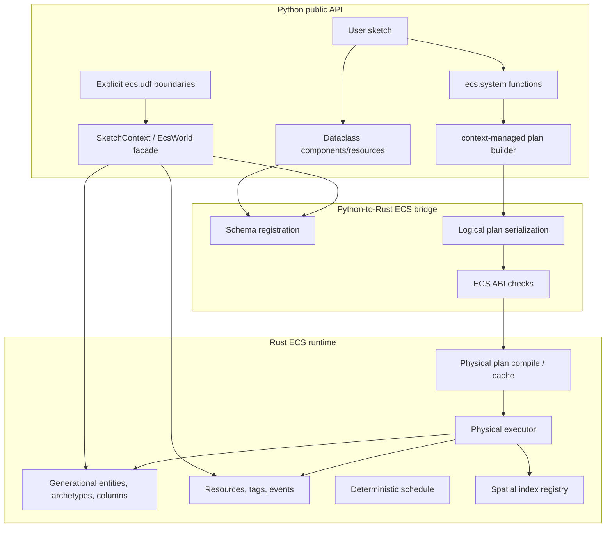

# ECS Architecture

Gummy Snake's ECS is a Pythonic logical-plan API backed by Rust-owned storage and
physical execution. The public surface is designed to feel like typed Python data
workflows: dataclass components behave like tables/columns, query expressions
compose into lazy plans, and decorated systems record action trees through
context-managed build sessions rather than running Python loops over component
data.

## High-level shape



Python owns API naming, annotations, validation, dataclass schema discovery,
logical-plan construction, explicit UDF invocation, and friendly entity/resource
views. Rust owns canonical entity/component/tag/resource/event storage, query
matching, spatial indexes, compiled physical plans, and non-UDF system execution.
Do not add a Python mirror of component columns or a Python runtime fallback for
non-UDF systems.

## Logical-plan source hierarchy

`src/gummysnake/ecs/logical_plan/` is the internal ownership boundary for the
Python-declared, Rust-executed plan DSL. Its dependency direction is toward plan
models and specifications: actions and expressions are consumed by build sessions;
build sessions produce action trees; inspection reads those trees; physical payload
serialization consumes them at the separate bridge boundary. This package does not
own scheduling, world storage, renderer implementations, or non-UDF execution.

| Area | Path | Responsibility |
| --- | --- | --- |
| Actions and UDF declarations | `logical_plan/actions/` | Action nodes, structural commands, iterable sources, and explicit UDF/UDF-plan declarations. |
| Expressions | `logical_plan/expressions/` | Lazy core nodes, query/resource proxies, grouped/exists nodes, and expression helpers. |
| Plan building | `logical_plan/building/` | Context-local build sessions plus `do`, conditionals, and `for_each` scopes. |
| Plan inspection | `logical_plan/inspection/` | Read-only write/query analysis and explain formatting. |
| System declarations | `logical_plan/systems/` | Decorators and built system definitions that validate annotations and record plans once. |
| Plan specifications | `logical_plan/specifications.py` | Query/resource/event annotation specifications and event proxies. |

The documented public compatibility surfaces are `gummysnake.ecs`,
`gummysnake.ecs.actions`, and `gummysnake.ecs.expressions`; the older focused
module paths forward the same objects for import compatibility. Keep exports
explicit rather than generating them dynamically. `scripts/structure_audit.py`
checks every Python package directory for ambiguous same-stem module/package
pairs, including this hierarchy.

## Source map

| Area | Path | Responsibility |
| --- | --- | --- |
| Public ECS exports | `src/gummysnake/ecs/__init__.py` | Explicit user-facing ECS names. |
| Context/global/object APIs | `src/gummysnake/api/ecs.py`, `src/gummysnake/context_mixins/ecs.py`, `src/gummysnake/sketch/facade_mixins/ecs.py` | `gs.add_entity`, `gs.add_system`, resources, events, diagnostics, object-mode forwards. |
| Public expressions | `src/gummysnake/ecs/expressions/` | Thin compatibility package for lazy expression imports. |
| Actions/UDFs/events | `src/gummysnake/ecs/actions.py` | Public compatibility surface for action, UDF, event, and plan-building helpers. |
| System decorator | `src/gummysnake/ecs/systems.py` | Public compatibility surface that builds query/resource/event proxies from mandatory annotations. |
| Python world facade | `src/gummysnake/ecs/world.py` and `src/gummysnake/ecs/world_facade/` | `world.py` is the public compatibility surface. `world_facade/world.py` is the authoritative `EcsWorld`; `initialization.py` creates facade metadata after bridge validation and `schema_validation.py` discovers/registers schemas. |
| Runtime views and handles | `src/gummysnake/ecs/runtime_views.py` and `src/gummysnake/ecs/runtime_view_model/` | `runtime_views.py` preserves compatibility exports. The implementation package owns entity/mutation markers, Rust-backed component/resource views, entity views, event writers, and system handles without keeping component data. |
| World runtime adapters | `src/gummysnake/ecs/world_runtime/` | Private adapters grouped by entity/query, resource/event, explicit Python UDF/system access, Rust physical execution, and facade diagnostics/change state. |
| Physical payload builder | `src/gummysnake/ecs/physical.py` | Public compatibility surface for serializing Python action/expression trees into bridge payloads. |
| Spatial API | `src/gummysnake/ecs/spatial/` | Lazy spatial relations and algorithm config objects. |
| Rust bridge wrapper | `src/gummysnake/rust/ecs.py` | Import, ABI validation, and protocol for ECS objects exposed by `gummysnake.rust._canvas`. |
| Rust core ECS | `crates/gummy_ecs/` | Storage, scheduler, physical plan validation/execution, spatial indexes, diagnostics. |
| PyO3 exposure | `crates/gummy_canvas/` | Mandatory extension module that exposes canvas plus ECS bridge classes/functions. |

## Runtime ownership

Rust ECS storage is canonical:

- entities are generational handles (`ecs.Entity`) with stale-handle checks,
- component schemas are registered from dataclass field annotations,
- component columns live in Rust archetype/table storage,
- tags are zero-sized Rust-side labels,
- resources are singleton rows indexed by stable Rust component/field IDs,
- typed events are frame-stamped bounded Rust rings with sequence cursors,
- spatial indexes are owned by the Rust spatial registry/physical executor,
- compiled handles reference canonical immutable `PreparedPlan` values; equivalent
  optimized plans share typed operation metadata, fixed query slots, resolved field
  IDs, dependency/invariant metadata, and prepared spatial ownership,
- change records and their compact per-entity summaries are Rust-owned and retain
  only the active epoch, with monotonic mutation revisions across epoch changes.

Python keeps only light metadata required for the public API: dataclass type to
schema mappings, live entity slot metadata for friendly errors, scheduled-system
configuration, change-detection bookkeeping, UDF definitions, and Python-boundary
diagnostic counters. Rust owns event queues, event counters, and bounded diagnostic
message storage; the public snapshot merges those canonical values. `EntityView` and
`ResourceView` are Rust-backed accessors; they are
not independent Python component copies. `iter_component_fields()` is the
preferred draw-side path when a sketch needs many scalar field values because it
performs a Rust-backed batch read of selected columns.

## Python world facade package boundaries

`gummysnake.ecs.world.EcsWorld` remains the stable public class and is defined
by `world_facade/world.py`; it delegates focused responsibilities without
changing the public method surface:

- `world_facade/initialization.py` calls `create_ecs_world()` before the facade
  is usable. That call performs the mandatory canvas and ECS ABI validation, so
  missing or mismatched runtimes fail with rebuild guidance rather than creating
  an alternate Python world.
- `world_facade/schema_validation.py` validates dataclass annotations and sends
  schema metadata to the Rust bridge. It does not retain component values.
- `runtime_view_model/` is the canonical implementation package for entity
  handles/mutation metadata, component/resource views, entity views, event
  writers, and system handles. `runtime_views.py` is its compatibility export
  module; both paths expose the same objects.
- `world_runtime/entities.py` and `query.py` adapt entities and queries;
  `resources.py` adapts resources and events; `python_batch.py` and
  `python_system.py` are the explicit Python runtime boundary; and
  `physical_execution/` owns Rust-plan compilation, execution, and reports.
  `state.py` owns facade diagnostics, change markers, and invalidation state.

Dependencies flow from the public facade and runtime views into these adapters,
and then to `gummysnake.rust.ecs`. A Python UDF/system boundary can batch view
access and flush writes to Rust, but it is never a fallback for physical plans.
Physical execution does not invoke Python unless an explicit UDF/system boundary
was declared.

## Schema and storage types

Components and resources must be dataclasses. Plain Python annotations map to
stable default Rust storage:

| Python annotation | Default ECS storage |
| --- | --- |
| `bool` | `ecs.types.Bool` |
| `int` | `ecs.types.Int64` |
| `float` | `ecs.types.Float64` |
| `str` | `ecs.types.String` |

Use `typing.Annotated` with `gummysnake.ecs.types` to request narrower or more
specific storage:

```python
from dataclasses import dataclass
from typing import Annotated

from gummysnake import ecs
from gummysnake.ecs import types as ecs_t


@dataclass
class SpriteTile:
    width: Annotated[int, ecs_t.UInt16]
    height: Annotated[int, ecs_t.UInt16]
    velocity: Annotated[tuple[float, float], ecs_t.Vec2F32]
    trail: Annotated[list[float], ecs_t.List(ecs_t.Float32)]
```

The marker is physical metadata, not only validation metadata. Rust allocates
matching narrow scalar vectors, dictionary-coded categorical columns, fixed-width
vector columns, and packed typed-list offsets/value buffers. `List[T]` preserves
`T` in schema fingerprints and the ECS ABI; nested lists are rejected rather than
falling back to generic values.

Conversion is checked and centralized in `gummy_ecs::coerce_value_for_storage`.
Every Rust write boundary (components, resources, typed events, structural values,
batches, and plan writes) applies it. Integers never wrap or saturate and exact
integer executor operations do not route through `f64`. `Float32` narrows once at
each write using IEEE-754 round-to-nearest/ties-to-even, while non-finite values
and Float32 range overflow are errors. Python performs matching early validation,
but Rust remains authoritative for all bridge and physical-plan inputs.

Entity creation crosses the PyO3 boundary through one complete-row `spawn_batch`
request. Rust validates every schema, field, storage value, and tag in the batch
before mutating allocator, archetype, tag, revision, or change-journal state. The
normal Python `add_entity()` path uses this transaction even for one entity; the
former allocate-then-add bridge sequence is not exposed by ECS ABI 6.

The ABI marker is the complete bridge-shape contract. Python validates the native
marker and health result before constructing `EcsWorld`; it does not probe individual
world methods or select a compatibility implementation. Missing or stale ABI entries
therefore fail with rebuild guidance rather than entering a legacy path.

## System lifecycle

A decorated system plan is a build function, not a per-frame Python loop:

1. `@ecs.system_plan` wraps a Python function as a Rust-executed `SystemDefinition`.
2. `gs.add_system(...)` calls the function once with query/resource/event proxy
   objects derived from mandatory type annotations.
3. The function records mutations/blocks into the active build session and returns `None`.
4. The root build block produces a `SystemPlan` for explain output and serialization.
5. `build_physical_payload()` serializes supported non-UDF expressions/actions.
6. Rust validates/optimizes the bridge payload and prepares typed operations once
   for the current incremental schema version/fingerprint.
7. Canonically equivalent handles share the immutable prepared state while retaining
   independent public lifetimes; final release frees prepared bytes and decrements
   owned spatial keys directly.
8. Each ECS phase executes the cached prepared plan against Rust storage. Dynamic
   frame input is supplied at execution and does not recompile the typed operation
   table.

Systems run every drawn frame after timing/input state is updated. The public
draw callback is registered as an explicit Python ECS system in the built-in
`draw` group, so ECS groups determine the relative order of simulation and
drawing work. Plugins observe each group with generated lifecycle hooks named
`before_<group_name>(context)` and `after_<group_name>(context)`, for example
`before_simulation`, `after_simulation`, `before_draw`, and `after_draw`.

## Scheduling and determinism

`gs.add_system()` accepts:

- `group=` to place a system in an explicit named group,
- `before=` and `after=` dependencies for systems that use their implicit
  `system_<system_name>` group,
- `enabled=` for registration-time enable state,
- `run_if=` for frame-level Python conditions.

`gs.group(name, before=..., after=..., enabled=..., run_if=...)` creates or
configures a group, and `gs.order(["input", "simulation", "draw"])` adds a
left-to-right group ordering constraint. Referencing a group auto-creates it, but
all group names must be `snake_case` so generated plugin hook names are stable.
A system may belong to multiple intersecting groups, for example
`group=("draw", "draw_background")`; it still runs once, but all memberships
contribute ordering constraints, group enable/run conditions, and generated
lifecycle hooks. Intersections are valid only when group orders agree: a system
cannot belong to two mutually ordered groups, and derived system-order cycles
raise `SystemPlanError`. A system may use `before=`/`after=` only when it does
not provide `group=`; explicitly grouped systems should order their groups
instead. Schedules are topologically sorted with stable tie-breaks, and systems
with equivalent group constraints run in registration order.

`do_in_order(*actions)` is serial and later actions observe writes from earlier
actions. `do_in_parallel(*actions)` represents independent snapshot-style work.
The Rust structural command buffer has an explicit apply barrier that preflights the
complete declared command sequence against a lightweight membership overlay; a late
invalid add/remove/despawn therefore cannot partially apply earlier staged commands
or drain the pending buffer.
Prepared query bindings use fixed slots rather than per-row string maps. Batched
compiled plans derive field-level read/write conflicts, so same-component disjoint
fields can share a deterministic wave. Those non-overlapping waves execute against
the canonical world in stable order and do not clone the world; row-level parallel
work remains inside the typed executor. Generic nested parallel action shapes that
have not yet moved to write/command buffers are still counted by
`ecs_scheduler_world_clones` and keep Epic 300 PBI 007 in progress.

Canvas actions recorded through `gummysnake.ecs.canvas` are serialized into Rust
plans. Eligible compact fill records can be passed directly to the Rust canvas
bridge. Command families that still require execution-report materialization are
counted by `ecs_canvas_python_replays` and
`ecs_canvas_python_materialized_commands`; completing those families without
Python replay remains Epic 300 PBI 010 work. Replay preserves report order and
logical-coordinate/HiDPI semantics. The `ecs.canvas` helpers are plan-building APIs only;
explicit Python ECS systems/UDFs that draw at runtime should call the normal
`gummysnake` drawing APIs. Rust plan systems are grouped into compatible physical
batches only when no input-state refresh, runtime Python UDF, or direct canvas
barrier requires a per-system execution boundary. Strict mode rejects overlapping
parallel writes and ambiguous joined writes. With strict mode off, execution
remains deterministic with last-write-wins semantics and ambiguity warnings unless
`warn_on_ambiguity=False` suppresses logging.

## Expressions, joins, and grouping

Query fields produce lazy expressions:

```python
@ecs.system_plan
def move(body: ecs.Query[Position, Velocity]) -> None:
    seconds = ecs.dt() / 1000.0
    with ecs.do(parallel=True):
        body[Position].x.increase_by(body[Velocity].dx * seconds)
        body[Position].y.increase_by(body[Velocity].dy * seconds)
```

Expressions support arithmetic, comparisons, `&`, `|`, `~`, `sqrt`, `abs`,
`sin`, `cos`, `floor`, `ceil`, `clamp`, `clamp_min`, and `clamp_max`. Python
`and`, `or`, `not`, and chained comparisons cannot build lazy plans and should
raise clearly.

Join shape is inferred from expression context. If a condition references two
query parameters, the plan creates the corresponding joined relation. Use
`group_by(query).any()`, `.count()`, `.sum(value)`, `.min(value, default=...)`,
`.max(value, default=...)`, or `.mean(value, default=...)` when multiple joined
rows should collapse to one decision/value per entity. Use
`ecs.exists(query).where(predicate)` when only existence matters.

When an action writes `query.ctx[Component].field`, the target query is filtered
by the current branch context, so users do not need to repeat the condition as an
indexing/filter expression.

## Actions

Public plan-building surfaces are:

- field mutation methods: `set_to`, `increase_by`, and `decrease_by`,
- `with ecs.do:` and `with ecs.do(parallel=True):` blocks,
- `with ecs.conditional():`, `with ecs.when(...):`, and `with ecs.otherwise():`,
- `with ecs.for_each(source) as item:` loop bodies,
- `writer.emit(event)` for typed event writer parameters,
- `query.entity.add_component(...)`, `remove_component(...)`, `add_tag(...)`,
  `remove_tag(...)`, and `despawn()` structural commands.

`Action` subclasses intentionally expose only valid continuation methods. For
example, a completed default action is not followed by `.otherwise()`, while a
`WhenAction` can be extended with additional `.when(...)` or `.otherwise()`
branches.

## Events

Typed ECS events are dataclass or scalar payloads. Python callbacks can emit and
read events through `gs.emit_event(event)`, `gs.read_events(EventType)`, and
`gs.clear_events(EventType | None)`. Systems use `ecs.EventWriter[T]` and
`ecs.EventReader[T]`:

```python
@dataclass
class Damage:
    amount: int


@ecs.system_plan
def hazards(writer: ecs.EventWriter[Damage]) -> None:
    writer.emit(Damage(3))


@ecs.system_plan
def apply_damage(reader: ecs.EventReader[Damage], health: ecs.ResMut[Health]) -> None:
    with ecs.for_each(reader) as event:
        health[Health].value.decrease_by(event.amount)
```

Event queues are Rust-owned, frame-stamped bounded rings retained long enough for
the next ECS phase to consume callback-emitted events. Each record has a stable
sequence and Rust readers can advance a cursor without cloning the complete queue.
Public reads are explicit materialization boundaries; plan-side event streams clone
only requested payload values, not `EventRecord` queues. Python does not retain a
second canonical event list or receive emitted-event payloads in normal physical
execution reports. The default per-type ring capacity is 65,536 records and dropped
records are observable through diagnostics.

## Spatial relations

Spatial APIs are generic query relations, not sketch-specific kernels. They live
under `ecs.spatial`:

- `point2`, `point3`, `aabb2`, `aabb3`,
- `neighbors(query, position=..., radius=...)` for self-neighbor queries,
- `join(origin, target, origin_position=..., target_position=..., radius=...)`,
- `overlaps(origin, target, origin_bounds=..., target_bounds=...)`,
- metadata: `.delta.x/y/z`, `.distance_sq`, `.distance`,
- filters: `.where(predicate)`,
- aggregates: `.any()`, `.count()`, `.sum(expr)`, `.min(...)`, `.max(...)`,
  `.mean(...)`,
- algorithms: `HashGrid`, `Quadtree`, `Octree`, and `HilbertCurve`.

Scheduled systems serialize these relations into Rust spatial physical plans.
`allow_fallback` remains accepted for source compatibility, but it applies only to
legacy relation materialization invoked from code already inside an explicit Python
boundary. Even `allow_fallback=True` cannot redirect a scheduled non-UDF system;
unsupported physical nodes fail closed. Dense all-moving spatial workloads may
choose rebuild-based strategies over incremental updates when that is faster and
deterministic. Sparse numeric and spatial precompute caches are keyed
by complete generation-safe `Entity` handles, so their memory follows live/query rows
rather than the largest historical entity index. Query-row-specialized paths retain
compact row-order vectors where the query itself provides a dense index.

## Explicit Python and compatibility boundaries

The scheduler has only two author-selected Python runtime boundaries:

- `@ecs.system` runs the declared callback with the GIL held and materializes only
  its declared queries as Rust-backed compatibility views.
- `@ecs.udf` runs the declared UDF action and materializes only its declared
  arguments/mutations. Mixed UDF sequences return to Rust for non-UDF actions.

Those views and batches read/write canonical Rust storage; they do not form a
Python component-column mirror or alternate executor. Logical-plan import aliases,
view/tuple adapters, expression `eval()` hooks, and spatial `iter_contexts()` remain
compatibility surfaces for code already inside an explicit Python/materialization
boundary. They must never be selected after non-UDF physical compilation fails.

`@ecs.udf_plan` is different: its Python function expands expressions once during
plan construction, then the prepared plan executes in Rust and
`ecs_udf_calls` remains zero. UDF annotations are mandatory. Use runtime Python
UDFs for side effects, external APIs, or operations that cannot be expressed in
the lazy DSL. Do not use them for hot component math that can be represented with
expressions/actions/spatial relations.

```python
@ecs.udf(mutations={"locations": {ecs.EntityMutation[Temperature](add=True)}})
def fetch_weather(locations: Iterable[ecs.Entity[Location]]) -> None:
    for location in locations:
        location.add_component(Temperature(fetch_temperature(location[Location].lon)))
```

Runtime UDF and Python-system calls increment separate diagnostics and should be
excluded from Rust-only acceleration claims unless the claim explicitly measures
that boundary. Conversely, nonzero `ecs_scheduler_world_clones` or ECS canvas
Python replay/materialization counters are not UDF allowances: they identify
remaining selectable migration paths and keep Epic 300 PBIs 007/010/011/012 open.

## Diagnostics and explain output

Use `system.explain()` to inspect the user-visible logical plan. Use
`gs.ecs_diagnostics()` or `world.diagnostics()` after bounded runs to inspect
scheduler, physical execution, ambiguity, UDF, event, resource, query, and
spatial counters. Important performance counters include:

- `ecs_physical_plan_compiles`, `ecs_physical_system_runs`,
- `ecs_steady_physical_plan_reuses`, `ecs_dynamic_change_plan_recompiles`,
- `ecs_prepared_plan_preparations`, `ecs_prepared_plan_cache_hits`,
  `ecs_prepared_plan_cache_misses`, `ecs_prepared_plan_canonical_reuses`,
  `ecs_prepared_plan_bytes_current`, `ecs_prepared_plan_bytes_peak`,
- `ecs_executor_fixed_slot_runs`, `ecs_executor_generic_slow_paths`,
- `ecs_scheduler_waves`, `ecs_scheduler_systems`,
  `ecs_scheduler_world_clones`, `ecs_scheduler_snapshot_bytes`,
- `ecs_physical_rows_scanned`, `ecs_physical_fields_written`,
- `ecs_rust_compiled_plans`,
- `ecs_udf_calls`,
- `ecs_ambiguity_warnings`, `ecs_strict_mode_errors`,
- `ecs_event_records_total`, `ecs_events_emitted`, `ecs_events_read`,
  `ecs_event_records_dropped`, `ecs_event_queue_bytes`,
- `ecs_python_event_mirror_entries`, `ecs_python_event_payload_materializations`,
- `ecs_resource_row_bytes`,
- `ecs_spatial_candidate_rows`, `ecs_spatial_exact_rows`,
  `ecs_spatial_index_owners`, `ecs_spatial_index_cache_entries`,
- `ecs_canvas_python_replays`, `ecs_canvas_python_materialized_commands`,
- `ecs_spatial_algorithm_hash_grid`, `ecs_spatial_algorithm_quadtree`,
  `ecs_spatial_algorithm_octree`, `ecs_spatial_algorithm_hilbert_curve`.

Keep public diagnostics stable and avoid leaking transient Rust implementation
IDs unless they are explicitly labelled debug-only.

## Validation

For ECS changes, run the smallest focused checks first and broaden before handoff:

```sh
uv run ruff check src/gummysnake/ecs tests/unit/ecs
uv run mypy src/gummysnake/ecs
uv run pytest tests/unit/ecs -q
cargo test --manifest-path crates/gummy_ecs/Cargo.toml
cargo test --manifest-path crates/gummy_canvas/Cargo.toml
uv run python examples/10_ecs/firefly_constellation.py --headless --frames 1 --no-save
uv run python examples/10_ecs/crystal_moths.py --headless --frames 1 --no-save
uv run python examples/09_performance/boids_3d.py --headless --frames 1 --no-save
```

Resource lifecycle stress checks are opt-in:

```sh
uv run pytest tests/stress/test_ecs_spatial_lifecycle_stress.py --run-stress -q -s
```

Use a release-built `gummy_canvas` extension for performance investigation or comparison:

```sh
uvx maturin develop --release --manifest-path crates/gummy_canvas/Cargo.toml --features extension-module
```
