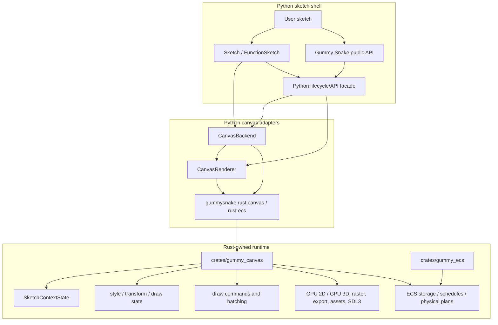

# Contributor Guide

These docs are for contributors who want to understand how Gummy Snake is built.

- [Architecture](architecture.md)
- [Backend and renderer boundaries](backend_renderer.md)
- [Runtime model](runtime.md)
- [Runtime diagnostics](runtime_diagnostics.md)
- [ECS architecture](ecs_architecture.md)
- [ECS debugging and performance triage](ecs_debugging.md)
- [Build capabilities](build_capabilities.md)
- [Feature scope decisions](feature_scope_decisions.md)
- [API performance policy](api_performance_policy.md)
- [Text renderer decision](text_renderer_decision.md)
- [Native 3D renderer plan](native_3d_plan.md)
- [ECS release checklist](ecs_release_checklist.md)
- [ECS context-manager API release notes](ecs_context_manager_release_notes.md)
- [Testing and CI](testing.md)
- [Documentation workflow](documentation.md)

## Project Shape



Gummy Snake is canvas-first and ECS-accelerated. The Rust `gummy_canvas` crate
provides the required runtime for sketch context state, drawing, presentation,
image loading, pixels, export, text, native window/input support when available,
and the PyO3 bridge to the Rust `gummy_ecs` storage/execution crate.

## Reading Order

Start with [Architecture](architecture.md) if you are new to the project. It
explains the main Python objects and how a public API call reaches the renderer.

Read [Backend and renderer boundaries](backend_renderer.md) before changing
anything in `src/gummysnake/backend/`, `src/gummysnake/backend/canvas_runtime/`,
`src/gummysnake/rust/`, or `crates/gummy_canvas/`. Most runtime regressions come
from putting a behavior in the wrong layer.

Read [Runtime model](runtime.md) before touching lifecycle, frame scheduling,
interactive mode, headless mode, input dispatch, HiDPI behavior, or WEBGL
behavior. Read [Native 3D renderer plan](native_3d_plan.md) before broadening
native 3D capability flags, adding new 3D GPU resource classes, or enabling
native user shader execution.

Read [Runtime diagnostics](runtime_diagnostics.md) when changing renderer
counters, fallback boundaries, benchmark scenes, or interactive frame pacing.
Read [ECS architecture](ecs_architecture.md) before changing ECS storage,
logical-plan serialization, physical execution, scheduling, resources/events, or
spatial indexes. Read [ECS debugging and performance triage](ecs_debugging.md)
before changing ECS explain output, diagnostics, strict-mode behavior, UDF
execution, or spatial fallback boundaries.

Read [Build capabilities](build_capabilities.md) when changing packaging,
runtime import checks, cargo features, optional extras, or runtime capability
probes.

Read [API performance policy](api_performance_policy.md) before adding public
APIs, changing pixel/image behavior, or documenting performance-sensitive
drawing patterns.

Read [Text renderer decision](text_renderer_decision.md) before changing text
layout, text metrics, glyph caching, or GPU text batching.

Read [Testing and CI](testing.md) before adding tests or changing workflows.

## Refactored Source Layout

- `src/gummysnake/api/`: public entry points grouped by topic, split global-mode modules, current context helpers, and compatibility facades.
- `src/gummysnake/context_mixins/`: `SketchContext` behavior mixins grouped by API area.
- `src/gummysnake/sketch/`: lifecycle runtime, decorator builder, and object-mode facade mixins.
- `src/gummysnake/constants/`: enum-backed public constants and aliases.
- `src/gummysnake/assets/`: image/text/data/model/shader/sound/media wrappers; `assets/image/core.py` owns the public `Image` class.
- `src/gummysnake/backend/canvas.py` and `canvas_renderer.py`: public facade classes.
- `src/gummysnake/backend/canvas_runtime/host/`: backend/runtime, event, and frame-pacing implementation mixins.
- `src/gummysnake/backend/canvas_runtime/renderer/`: renderer bridge, lifecycle, cache, payload, batch-state, and drawing implementation helpers.
- `src/gummysnake/ecs/`: Python ECS public API, logical expressions/actions, system builder, physical payload serialization, and Rust-backed world facade.
- `src/gummysnake/drawing/`: renderer protocols, `renderer3d` package, `software3d` helpers, and retained prototype helpers.
- `src/gummysnake/rust/`: Python wrappers around PyO3 modules and Rust-backed kernels, including ECS ABI validation.
- `tests/helpers/` and `tests/fixtures/`: shared test support and package/file fixtures.
- `scripts/source_size_audit.py` and `scripts/structure_audit.py`: lightweight layout guardrails for refactors.

## Local Commands

```sh
uv sync --dev
uvx maturin develop --manifest-path crates/gummy_canvas/Cargo.toml --features extension-module
cargo test --manifest-path crates/gummy_canvas/Cargo.toml
cargo test --manifest-path crates/gummy_ecs/Cargo.toml
uv run ruff check .
uv run mypy src
uv run pytest
```

## Design Constraints

- Keep public APIs Pythonic and `snake_case`.
- Do not add JavaScript, HTML, DOM APIs, browser dependencies, or browser-only
  runtime paths.
- Do not reintroduce Pillow or Pyglet fallback rendering.
- Keep `gummysnake.rust._canvas` required for canvas runtime behavior.
- Keep Rust implementation details out of user-facing API names.
- Prefer deterministic headless tests for behavior changes.
