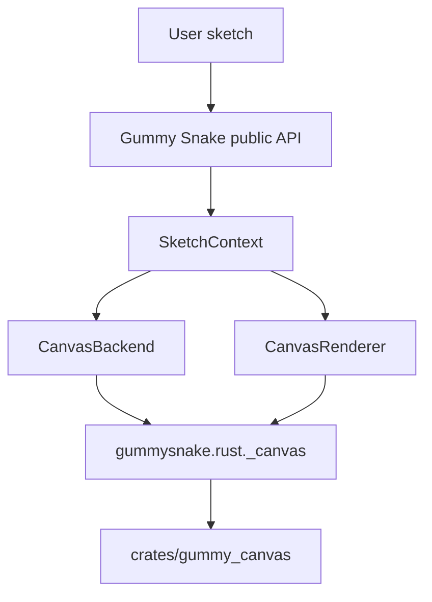

# Contributor Guide

These docs are for contributors who want to understand how Gummy Snake is built.

- [Architecture](architecture.md)
- [Backend and renderer boundaries](backend_renderer.md)
- [Runtime model](runtime.md)
- [Runtime diagnostics](runtime_diagnostics.md)
- [Build capabilities](build_capabilities.md)
- [API performance policy](api_performance_policy.md)
- [Native 3D renderer plan](native_3d_plan.md)
- [Testing and CI](testing.md)
- [Documentation workflow](documentation.md)

## Project Shape



Gummy Snake is canvas-first. The Rust `gummy_canvas` extension is the required runtime for
drawing, presentation, image loading, pixels, export, text, and native
window/input support when available.

## Reading Order

Start with [Architecture](architecture.md) if you are new to the project. It
explains the main Python objects and how a public API call reaches the renderer.

Read [Backend and renderer boundaries](backend_renderer.md) before changing
anything in `src/gummysnake/backend/`, `src/gummysnake/backend/_canvas/`,
`src/gummysnake/rust/`, or `crates/gummy_canvas/`. Most runtime regressions come
from putting a behavior in the wrong layer.

Read [Runtime model](runtime.md) before touching lifecycle, frame scheduling,
interactive mode, headless mode, input dispatch, HiDPI behavior, or current
software WEBGL behavior. Read [Native 3D renderer plan](native_3d_plan.md)
before moving WEBGL drawing into `gummy_canvas`.

Read [Runtime diagnostics](runtime_diagnostics.md) when changing renderer
counters, fallback boundaries, benchmark scenes, or interactive frame pacing.

Read [Build capabilities](build_capabilities.md) when changing packaging,
extension import checks, cargo features, optional extras, or runtime capability
probes.

Read [API performance policy](api_performance_policy.md) before adding public
APIs, changing pixel/image behavior, or documenting performance-sensitive
drawing patterns.

Read [Testing and CI](testing.md) before adding tests or changing workflows.

## Refactored Source Layout

- `src/gummysnake/api/`: public entry points, split global-mode modules, current context, and facades.
- `src/gummysnake/_context/`: `SketchContext` behavior mixins grouped by API area.
- `src/gummysnake/sketch/`: lifecycle runtime, decorator builder, and object-mode facade.
- `src/gummysnake/constants/`: enum-backed public constants and aliases.
- `src/gummysnake/backend/canvas.py` and `canvas_renderer.py`: public facade classes.
- `src/gummysnake/backend/_canvas/`: internal canvas backend and renderer mixins.
- `src/gummysnake/rust/`: Python wrappers around PyO3 extensions and Rust-backed kernels.

## Local Commands

```sh
uv sync --dev
uvx maturin develop --manifest-path crates/gummy_canvas/Cargo.toml --module-name gummysnake.rust._canvas --python-source src --features extension-module
uv run ruff check .
uv run mypy src
uv run pytest
```

## Design Constraints

- Keep public APIs Pythonic and `snake_case`.
- Do not add JavaScript, HTML, DOM APIs, browser dependencies, or browser-only
  runtime paths.
- Do not reintroduce Pillow or Pyglet fallback rendering.
- Keep `gummysnake.rust._canvas` required for canvas runtime behavior.
- Keep Rust implementation details out of user-facing API names.
- Prefer deterministic headless tests for behavior changes.
