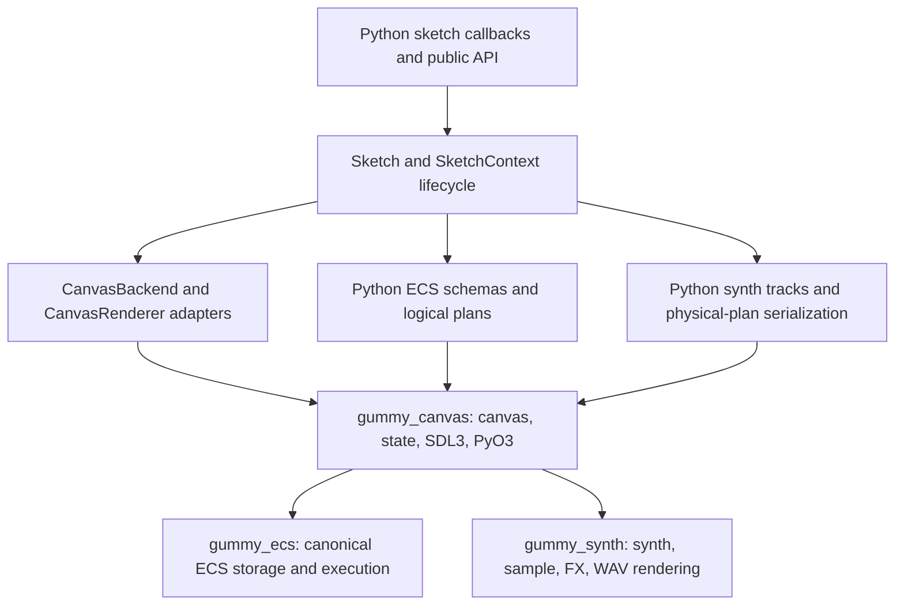

# Contributor Ownership Map

This is the canonical high-level map for contributors. Use it to find the owner
of a behavior and its smallest useful validation route. Detailed design rules
remain in the linked subsystem guides; do not duplicate them here.

## Runtime direction

Python owns public names, validation, callback and plugin orchestration, logical
ECS plans, explicit runtime Python UDF boundaries, and friendly facade objects.
Rust owns canvas state and rendering, native presentation/input, assets/pixels/text,
canonical ECS storage and non-UDF execution, and synth/sample/FX/WAV rendering.
There is no supported Python renderer, non-UDF ECS executor, or synth renderer
fallback. See [Runtime contracts](runtime_contracts.md) for the frozen boundary.

## Python source map

| Area | Canonical owner | Composition or compatibility surface | Focused checks |
| --- | --- | --- | --- |
| Public API | `src/gummysnake/api/` | `src/gummysnake/__init__.py`, `src/gummysnake/api/global_mode/` | `tests/unit/api_lifecycle/test_public_api_contract.py`, `tests/unit/api_lifecycle/test_public_facade_contract.py` |
| Constants | `src/gummysnake/constants/` | explicit package exports | `tests/unit/api_lifecycle/test_public_api_exports.py`, constants/reference checks |
| Sketch lifecycle | `src/gummysnake/sketch/` | `src/gummysnake/sketch/__init__.py` | `tests/unit/api_lifecycle/test_lifecycle.py`, `tests/unit/api_lifecycle/test_plugins.py` |
| Active context behavior | `src/gummysnake/context.py`, `src/gummysnake/context_mixins/` | public API/context facades | `tests/unit/api_lifecycle/test_global_api.py`, lifecycle and drawing tests |
| Canvas host and renderer adapters | `src/gummysnake/backend/canvas_runtime/` | `src/gummysnake/backend/canvas.py`, `src/gummysnake/backend/canvas_renderer.py` | `tests/contracts/`, `tests/unit/canvas_runtime/test_rust_canvas_backend*.py` |
| Assets and data wrappers | `src/gummysnake/assets/` | topic APIs under `src/gummysnake/api/` | image, model, sound, media, and pixel unit tests |
| Shared value/state types | `src/gummysnake/core/` | public API adapters | `tests/unit/api_lifecycle/test_color_transform.py`, input, pixel, and math tests |
| Drawing and 3D helpers | `src/gummysnake/drawing/` | three-D context/API modules | integration WEBGL tests and bounded WEBGL smoke examples |
| Fast draw facade | `src/gummysnake/fast_draw_runtime/` | `gs.fast()` and `Sketch.fast()` | drawing and public API tests |
| Plugins | `src/gummysnake/plugins/` | `SketchContext` lifecycle dispatch | `tests/unit/api_lifecycle/test_plugins.py`, `tests/unit/ecs/test_ecs_schedule.py` |
| ECS public and logical-plan layer | `src/gummysnake/ecs/logical_plan/` | `src/gummysnake/ecs/world.py` remains a compatibility facade; `world_facade/` owns the Python world implementation, while `logical_plan/` owns actions, expressions, build sessions, inspection, decorators, and specifications | `tests/unit/ecs/test_ecs_core.py`, `tests/unit/ecs/test_ecs_plans.py`, `tests/unit/ecs/test_ecs_schedule.py`, `tests/unit/ecs/test_ecs_spatial.py` |
| ECS expressions and spatial relations | `src/gummysnake/ecs/logical_plan/expressions/`, `src/gummysnake/ecs/spatial/` | `src/gummysnake/ecs/actions.py`, `expressions/`, `systems.py`, and `physical.py` are explicit public composition surfaces | ECS plan and spatial tests |
| Synth plans and playback controls | `src/gummysnake/synth/` | `src/gummysnake/synth/core.py` | synth unit and bridge tests |
| Rust wrapper boundary | `src/gummysnake/rust/` | package-local typed wrappers | `tests/unit/canvas_runtime/test_rust_canvas.py`, `tests/unit/ecs/test_ecs_bridge.py`, `tests/unit/canvas_runtime/test_rust_acceleration.py` |
| Optional acceleration | `crates/gummy_accel/` plus `src/gummysnake/rust/` wrapper | optional `_accelerated` extension | `tests/unit/canvas_runtime/test_rust_acceleration.py` |

`src/gummysnake/ecs/world.py` remains an import-compatible facade, not the
implementation home. Likewise, `ecs/expressions/` and `ecs/spatial/` are packages;
the old singular `expressions.py` and `spatial.py` paths are not current files.

## Lifecycle navigation

The normal `draw()` callback is a Python ECS system in the built-in `draw` group.
Each enabled group is surrounded by generated plugin hooks named
`before_<group>` and `after_<group>`—for example `before_simulation`,
`after_simulation`, `before_draw`, and `after_draw`. Do not describe or add
obsolete generic `before_ecs` / `after_ecs` lifecycle hooks.

Read [Runtime model](runtime.md#frame-order) for exact frame ordering,
[Sketch lifecycle](../reference/lifecycle.md) for public lifecycle APIs, and
[ECS architecture](ecs_architecture.md) for group scheduling and physical-plan
execution.

## Rust crate landing pages

| Crate | Purpose and Python exposure | ABI/build role | Focused command |
| --- | --- | --- | --- |
| [`gummy_canvas`](../../crates/gummy_canvas/) | Required canvas/runtime crate. It exposes `gummysnake.rust._canvas`, canvas state, rendering, assets, SDL3 input/windowing, and the linked ECS/synth bridge. | Owns canvas ABI `18`; no Python fallback. | `cargo test --manifest-path crates/gummy_canvas/Cargo.toml` |
| [`gummy_ecs`](../../crates/gummy_ecs/) | Canonical ECS storage, schedules, physical plans, events/resources, and spatial indexes, linked through canvas. | Owns ECS ABI `4`; no Python non-UDF executor. | `cargo test --manifest-path crates/gummy_ecs/Cargo.toml` |
| [`gummy_synth`](../../crates/gummy_synth/) | Synth, sample, FX, decoding, and WAV rendering, linked through canvas. | Mandatory synth rendering; no Python audio/synth fallback. | `cargo test --manifest-path crates/gummy_synth/Cargo.toml` |
| [`gummy_accel`](../../crates/gummy_accel/) | Small optional accelerated kernels exposed by `_accelerated`. | Optional only; never substitutes for mandatory canvas/ECS/synth runtime behavior. | `cargo test --manifest-path crates/gummy_accel/Cargo.toml` |

Each crate root documents its ownership boundary without duplicating this map:
`gummy_canvas` owns the PyO3 registration boundary and canvas runtime;
`gummy_ecs` remains PyO3-free; `gummy_synth` owns rendering rather than Python
parsing; and `gummy_accel` is intentionally small and optional. Use
[Runtime contracts](runtime_contracts.md) for stable source/runtime contracts and
[Build capabilities](build_capabilities.md) for packaging and rebuild steps.

## Contributor entry points

- **New contributors:** start with [Architecture](architecture.md), then this map,
  [Runtime model](runtime.md), and [Testing and CI](testing.md).
- **Runtime work:** use [Backend and renderer boundaries](backend_renderer.md),
  [Runtime contracts](runtime_contracts.md), and
  [Runtime diagnostics](runtime_diagnostics.md).
- **ECS work:** use [ECS architecture](ecs_architecture.md) and
  [ECS debugging](ecs_debugging.md).
- **Synth work:** start at `src/gummysnake/synth/`, then
  `crates/gummy_synth/` and the synth-focused tests.
- **Tests:** [Testing and CI](testing.md) defines test placement and commands;
  `tests/helpers/` holds reusable fakes and `tests/fixtures/` holds file/package
  data. Resource stress tests are opt-in.
- **Examples:** `examples/01_getting_started/` through `examples/12_synth/`
  are topic-ordered runnable entry points. `examples/games/` contains larger
  complete sketches; `examples/assets/` is shared example input; generated output
  belongs under `examples/output/`.
- **Automation and release:** `scripts/` owns local audit, asset, version, and
  distribution helpers. `Makefile` provides their common targets;
  `.github/workflows/` owns CI/release invocation; `pyproject.toml`, `uv.lock`,
  `Cargo.toml`, and crate manifests are package/build inputs.

The root [README](../../README.md) links to the contributor guide, and
`CLAUDE.md` intentionally remains a pointer to `AGENTS.md` rather than a second
set of agent rules.
