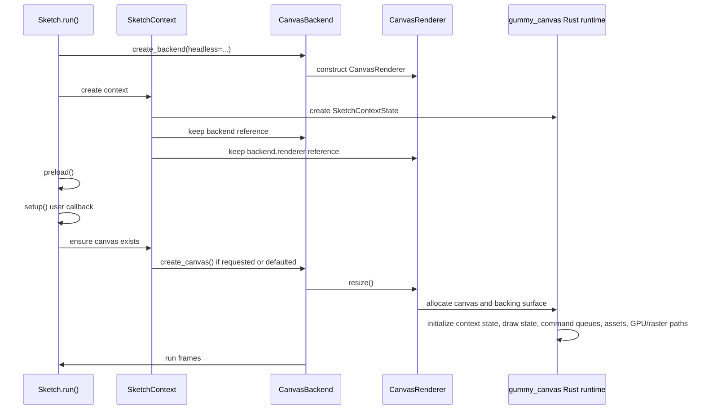
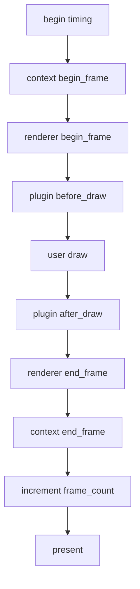
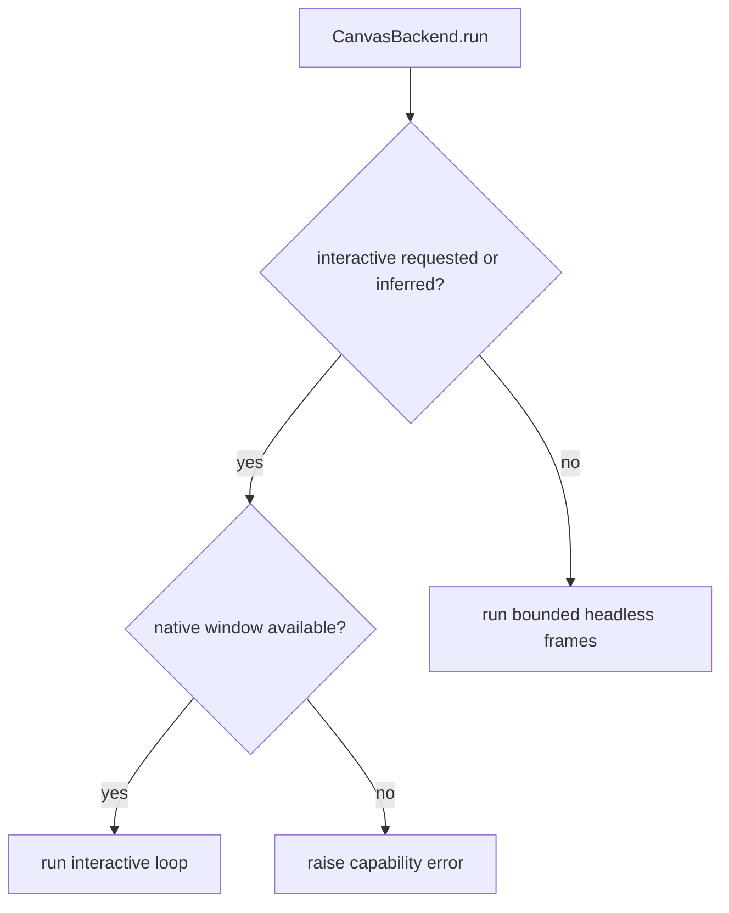
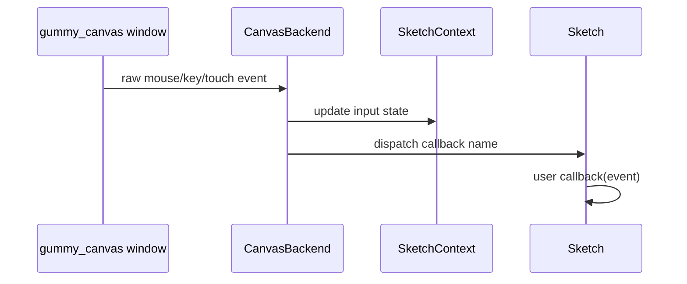

# Runtime Model

The runtime is canvas-first and bounded/headless runs still use `gummy_canvas`.
There is no supported Pillow or Pyglet fallback.

The runtime starts in Python, creates a Python context, and then uses the Rust
canvas runtime for canvas work. Rust provides native interactive windows and
input through the SDL3-backed `gummy_canvas` desktop runtime when those
capabilities are available, but Python still owns callback/plugin orchestration
and public API policy. The mutable sketch context state that affects scheduling,
input readback, canvas dimensions, and shape capture lives in Rust
`SketchContextState`.

## Startup Sequence

`Sketch.run()` performs these high-level steps:

1. Build a backend with `create_backend(headless=...)`.
2. Create `SketchContext(sketch, backend, plugins=...)`.
3. Bind plugin runtime state.
4. Activate the context so global-mode functions can find it.
5. Dispatch `before_preload` plugin hooks.
6. Run user `preload()`.
7. Dispatch `before_setup` plugin hooks.
8. Run user `setup()`.
9. Ensure a canvas exists, creating the default canvas if needed.
10. Dispatch `after_setup` plugin hooks.
11. Ask the backend to run frames.

The key point is that the backend does not call `setup()` or `draw()` directly.
`Sketch` owns callback order; `CanvasBackend` owns runtime execution.

Runtime implementation files follow that ownership split:

- `src/gummysnake/sketch/` owns lifecycle dispatch and decorator/object-mode
  sketch plumbing.
- `src/gummysnake/context.py` and `src/gummysnake/context_mixins/` own Gummy
  Snake semantics, validation, plugin hooks, and Python-facing state facades.
- `src/gummysnake/backend/canvas_runtime/host/` owns backend runtime behavior:
  headless vs interactive execution, native window capability checks, event
  polling/normalization, pacing, and shutdown.
- `src/gummysnake/backend/canvas_runtime/renderer/` owns Python-to-Rust renderer
  translation: canvas resize/create, style/transform sync, caches, payload
  builders, primitive/image/text/pixel forwarding, and renderer counters.
- `crates/gummy_canvas/src/` owns the Rust canvas runtime, SDL3 integration,
  draw-command construction, batching, assets, pixels, text, export, and GPU/raster
  rendering.

## Frame Order

Keep this ordering intact when changing lifecycle behavior.

## Frame Scheduling

The draw loop checks Rust-owned Gummy Snake lifecycle flags before drawing:

- if `state.looping` is true, draw every scheduled frame
- if `state.redraw_requested` is true, draw one frame even when looping is off
- otherwise skip drawing

`no_loop()` sets `state.looping` false. `loop()` sets it true. `redraw()` marks a
single frame as requested. These Python properties are facades over
`SketchContextState`; after a frame is drawn, the Rust-owned
`redraw_requested` flag is cleared.

Interactive runs schedule frames according to the target frame rate and poll
SDL3 native events between frames. The Rust runtime also pumps native events
around presentation and selected long-running canvas operations so close, resize,
and input events can still be observed while Python drawing work is active.
Headless bounded runs draw a fixed number of frames as quickly and
deterministically as possible.

## Headless vs Interactive

- `headless=True` or `--headless`: bounded offscreen canvas behavior for tests,
  CI, export, and repeatable scripts.
- `headless=False` or `--interactive`: native interactive behavior when the
  installed runtime supports it.
- Missing canvas runtime or missing native-window support should fail with a
  clear capability error and rebuild guidance.
- A stale or partial canvas runtime should fail during
  `require_canvas_runtime()` if its health check or `CANVAS_ABI_VERSION`
  marker does not match the Python package.

## Input Dispatch

When native input is available, the SDL3-backed Rust runtime emits window/input
events. `CanvasBackend` polls those events, normalizes them into Python event
dataclasses, updates Rust `SketchContextState` through the
`SketchContext.state.input` facade, and then dispatches optional user
callbacks. SDL3 pointer, wheel, and touch coordinates are logical/window
coordinates; Rust payloads must mark them with `coordinates = "logical"` so the
Python backend does not divide them by pixel density again. One-character SDL3
key names should be normalized to lowercase before crossing into Python so
`KeyboardEvent.matches("l")` remains stable.

Input state should always be updated in `SketchContextState` before the user
callback runs, so callback code sees the same values that later Gummy Snake
input functions return.

## HiDPI

Gummy Snake separates logical and physical size:

- `width()` and `height()` return logical dimensions.
- `pixel_density()` controls physical backing scale.
- `load_pixels()` and `update_pixels()` operate on physical top-left RGBA
  buffers.
- Built-in WEBGL model draws should avoid projected face payloads on the GPU
  path. The canvas runtime retains model buffers and uses GPU
  transform/projection/depth/material pipelines when available.
- Fallback software-3D projected points are logical canvas coordinates until
  the canvas runtime submits or rasterizes them. Any direct GPU primitive
  fallback must multiply those points by `pixel_density()` before building
  physical vertices.

Do not collapse logical and physical dimensions when touching renderer, export,
pixels, image, input coordinate code, GPU model drawing, or software-3D GPU
fallback submission. SDL3 resize events report logical window size plus display
scale; after a native resize, keep Rust `SketchContextState`, renderer
dimensions, physical backing size, export size, and input coordinates in sync.

## Asset, Image, And Pixel Ownership

Rust-managed assets are a performance boundary, not just an implementation
detail. Bulk asset bytes, geometry arrays, parsing, export, projection, metadata
extraction, and future asset processing should stay in `gummy_canvas` whenever
practical. Python wrappers should expose friendly, Pythonic APIs while avoiding
large Python object graphs until user code explicitly asks for them.

`load_image()`, `create_image()`, and mutated `Image` instances keep their RGBA
storage in a Rust-managed `CanvasImage` handle. Drawing an image should use
`Canvas.draw_canvas_image()` so repeated sprite draws stay on the canvas-owned
image/texture path without a Python byte upload.

Each image has a stable Rust `cache_key` and mutation `version`. Renderer caches
must use that key rather than `id(image)` so Python object-id reuse cannot draw
stale pixels. Image mutations increment `version` on the Rust handle while
preserving the same cache key.

The Rust canvas image and texture caches are bounded and are managed through
small internal cache helpers in `crates/gummy_canvas/src/canvas/cache.rs`. If
cache limits are changed, keep the lifecycle explicit, preserve hit/miss and
upload counters, and preserve tests that draw many transient images.

Image-local bulk operations are also canvas-owned. `Image.resize()`,
`Image.mask()`, supported `Image.filter(...)` modes, crop/copy helpers, and
image alpha compositing mutate or create Rust `CanvasImage` handles while Python
keeps public API validation and friendly return types.

Optional media capture/video helpers remain gated by the `media` extra, but
decoded grayscale, BGR, and BGRA frame conversion to RGBA is routed through
`gummy_canvas` once the media dependency supplies a contiguous frame buffer.

`load_model()` and generated software-3D primitives follow the same ownership
pattern for model assets. The public `Model3D` wrapper retains a Rust-owned
`CanvasModel3D` handle for parsed or generated vertex/index data, while the
Python `.meshes` view remains available and materializes lazily only when user
code inspects geometry. `Mesh3D` retains a Rust-owned `CanvasMesh3D` handle as
canonical storage; immutable tuple buffers are lazy inspection/interchange views,
not a runtime fallback. Optional NumPy vertex, normal, texture-coordinate, and
packed face-index arrays are also lazy inspection/interchange views over that
storage. Hot paths such as OBJ/STL export and WEBGL drawing should use Rust
handles directly instead of forcing repeated Python `Vec3` loops. Built-in
WEBGL model draws pack GPU-ready triangle data on Rust model handles and retain
GPU vertex/index buffers after first use. Per-frame draws should update small
transform/camera/material/light uniforms; transform, projection, depth testing,
texture sampling, and built-in material shading belong in GPU pipelines when
GPU drawing is available. Fallback software projection/shading/rasterization is
reserved for unsupported or CPU-only paths.

`load_sound()` keeps sound bytes and metadata in a Rust-owned `CanvasSound`
handle attached to the public `Sound` wrapper. Python still owns the friendly
playback controls for now, but duration and byte access should flow through the
Rust handle so future decoding, waveform analysis, resampling, and playback work
can happen without first copying sound data into Python-owned structures.

Remaining asset migration candidates are shader sources, font files/outline data,
and large generic byte/data assets. Migrate them when a runtime-owned operation
exists or is planned, such as shader validation/compilation, font outline/model
generation, or binary asset processing. Plain JSON/string helpers can stay
Python-owned until the runtime has a bulk operation that benefits from owning the
bytes.

Optional `gummy_accel` Python fallbacks, such as procedural noise and byte-wise
blend reference kernels, preserve correctness for environments without the
acceleration extension. Treat those Python kernels as reference implementations,
not performance paths for dense animation workloads. Benchmarks should report
whether the Rust acceleration extension handled the measured workload.

## Text And Font Cache Ownership

Rust owns rendered text line caching because it owns font loading, glyph
rasterization, and the texture keys used for GPU text presentation. The rendered
text cache is bounded by entry count and evicts least-recently used entries
before inserting new dynamic text. Eviction also drops the corresponding texture
version bookkeeping so stale texture keys are not reused after a text cache
entry is removed. Text cache policy lives in `canvas/cache.rs` and
`canvas/text/cache.rs`; shared wrapping, alignment, baseline, and metric payload
logic lives in `canvas/text/layout.rs` so draw and measurement paths stay
consistent.

The font cache is intentionally process-local to each canvas instance and keyed
by font path. It is bounded by the number of distinct font files a sketch uses;
normal dynamic text changes should not add font entries. If future font-family
resolution starts discovering many paths automatically, add an explicit bound
there too.

Renderer diagnostics expose `text_cache_hits`, `text_cache_misses`,
`text_cache_evictions`, and `text_measurements`. Dynamic counters or labels
should increase misses and eventually evictions without unbounded cache growth.

Text metrics must be measured with the same style revision that will be used for
drawing. After native/window synchronization, Python may still mutate
`StyleState`; do not use Rust current-style metric shortcuts unless the Python
style object and revision match the synced current style. Otherwise,
`text_width()`, ascent/descent, and `text_bounds()` can diverge from subsequent
`text()` rendering.

The GPU text path uses glyphon for untransformed default-font text when all
direct glyphon text commands can remain in a single contiguous ordered text
segment. If later text follows intervening primitives, images, blend/effect
passes, clips, or other command families, route that later text through the
cached line-texture path so draw order is preserved without queuing multiple
glyphon text passes against the same mutable atlas state. For large overlays or
native interactive paths where direct glyphon text is not the selected ordered
path, prefer the batched cached-text atlas fallback so cached line textures are
grouped into image batches instead of uploaded/drawn one label at a time.

`load_pixels()` returns the public `PixelBuffer`, a mutable list-like RGBA byte
buffer that preserves compatibility operations while tracking dirty byte ranges.
`load_pixel_bytes()` is the lower-copy readback path for effects that can work
with bytes, and `update_pixels()` accepts `PixelBuffer`, plain lists for
compatibility, and buffer-like inputs such as `bytes`, `bytearray`, and
`memoryview`. Dirty row-aligned `PixelBuffer` edits can upload through the Rust
region path instead of forcing a full-canvas upload.

Canvas region APIs use narrow Rust calls:

- `get(x, y)` reads one physical pixel region and returns `Color`.
- `get(x, y, w, h)` reads only the requested physical region into an `Image`.
- `set(x, y, color)` writes one physical pixel region.
- `set(x, y, image)` uploads and alpha-composites the image region in Rust.
- `filter(...)` applies supported full-canvas filters in Rust without a Python
  `Image` reconstruction.

Full-canvas `get()` and explicit `load_pixels()` still read the full physical
buffer by design.

## GPU Command Ordering

The 2D GPU renderer can mix primitive commands with image, text, pixel-effect,
and blend/effect commands in a single frame. Text may use direct glyphon draws
or cached line textures routed through the image/atlas pipeline, while shapes
such as `rect()` and `circle()` use primitive pipelines. Python-side batching may
coalesce mixed primitive records across local style/transform changes and image
records across per-sprite transforms, but it must flush at true semantic
ordering boundaries. When changing command encoding, batching, or adding command
families, flush any pending batch before switching pipelines and restore the
expected pipeline and bind groups before continuing. The ordered encoder uses a
small local `RenderPassBatcher` in `crates/gummy_canvas/src/gpu/render.rs`; when
special commands split a frame into multiple render-pass segments, reusable
vertex/image/model-buffer offsets must advance across the whole command encoder
so later `queue.write_buffer` calls cannot overwrite data referenced by earlier
passes. In particular, primitives drawn before and after text/images/effects
must remain visible; `examples/05_interaction/lifecycle_controls.py` and mixed
sprite/text/pixel benchmark scenes are useful ordering smoke tests.

## WEBGL Runtime Status

`create_canvas(..., WEBGL)` uses Rust-owned model/mesh handles and the canvas
runtime for OBJ parsing, primitive model generation, export, built-in material
state, and fallback software rasterization. When GPU drawing is available,
unstroked built-in primitive and loaded-model draws use retained GPU model
buffers plus GPU transform/projection, depth testing, texture sampling, and
built-in material shaders. `examples/09_performance/lorenz_attractor_3d.py`
exercises this retained model path with a generated tube mesh and animated
camera/lights. Backend capabilities therefore distinguish:

- `three_d`: WEBGL mode is accepted.
- `software_three_d`: WEBGL compatibility and fallback software 3D paths are
  available.
- `native_three_d`: the native runtime owns a broader native 3D feature set
  beyond the current built-in model pipelines.
- `shaders`: shader-style Python API objects are accepted.
- `native_shaders`: user shader programs are handled by the native renderer.

The canvas backend currently reports `three_d=True`, `software_three_d=True`,
`native_three_d=False`, `shaders=True`, and `native_shaders=False`. Built-in
GPU model pipelines do not imply user-programmable native shader execution. See
[`native_3d_plan.md`](native_3d_plan.md) before broadening native 3D capability
flags or adding native user shader execution.

## Canvas Creation And Synchronization

Canvas creation is a cross-layer operation:

1. `SketchContext.create_canvas()` validates the renderer kind and backend
   capability.
2. `CanvasBackend.create_canvas()` forwards the requested logical size and pixel
   density to the renderer.
3. `CanvasRenderer.resize()` asks Rust to allocate or resize the canvas.
4. `SketchContext._sync_canvas_state()` copies renderer dimensions into Rust
   `SketchContextState`; `SketchState.canvas` reads those values through its
   facade.

If a change resizes the canvas but does not synchronize `SketchContextState`,
`width()`, `height()`, `pixel_density()`, pixels, export, and input coordinates
can disagree.

## Failure Modes To Preserve

- Missing `gummysnake.rust._canvas` should raise a clear backend capability error.
- Incompatible `gummysnake.rust._canvas` ABI markers should raise a clear backend
  capability error before backend construction proceeds.
- Requesting interactive mode without native-window support should raise a clear
  capability error.
- GPU unavailable diagnostics should explain that headless CPU-backed rendering
  can continue while native presentation or GPU acceleration may be unavailable
  or slower.
- Unsupported renderer names should raise `ArgumentValidationError`.
- Requesting `WEBGL` on a backend without 3D support should raise
  `BackendCapabilityError`.
- Built-in GPU model pipelines should not imply `native_shaders` or broad
  native 3D feature support.
- Pixel operations should report capability problems explicitly instead of
  failing with unrelated buffer errors.
- SDL3 logical input coordinates should not be density-scaled twice.
- Fallback software-3D projected points should not be submitted to GPU
  primitives without physical pixel-density scaling.
- Mixed text/image and primitive GPU commands should preserve draw order and
  pipeline state, including primitives drawn after text.
