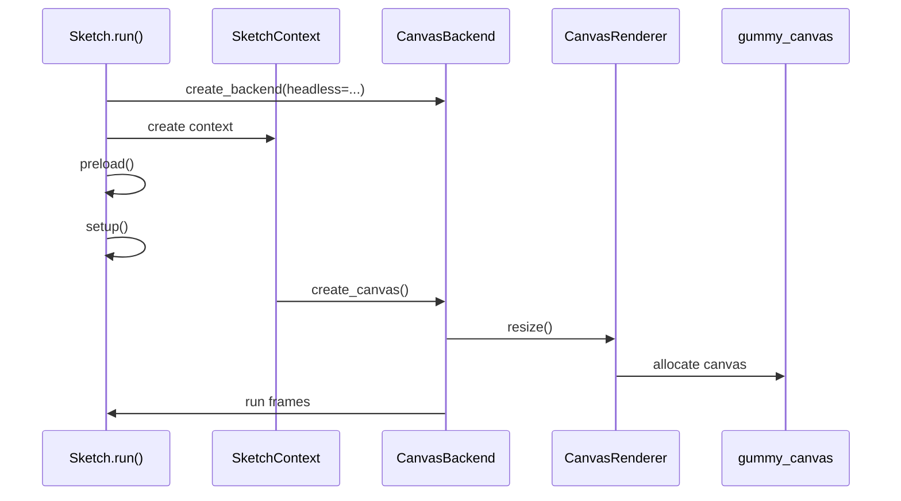
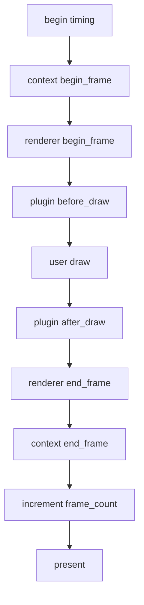
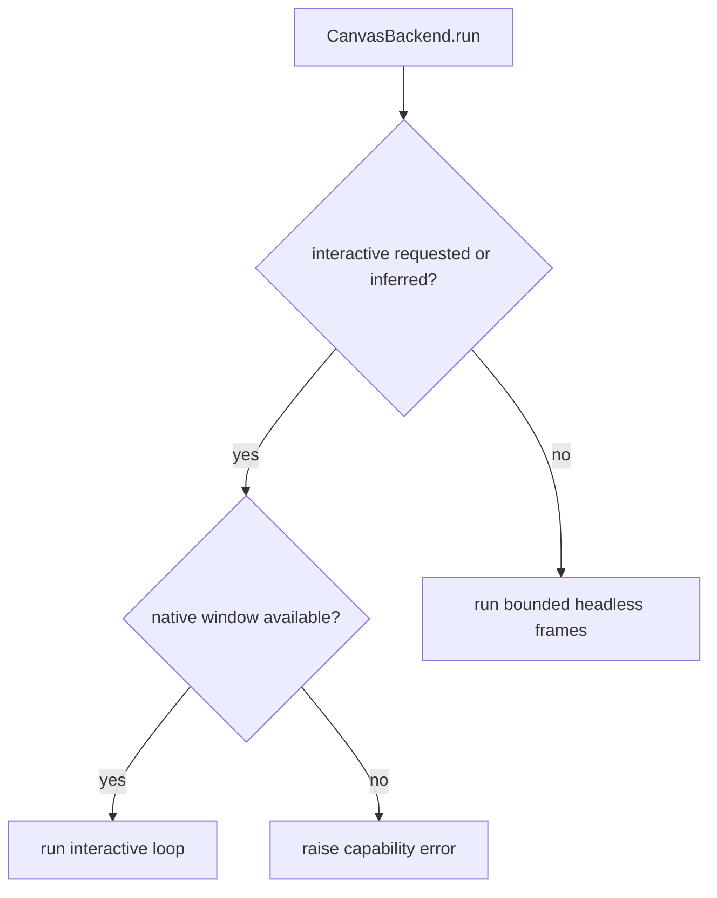
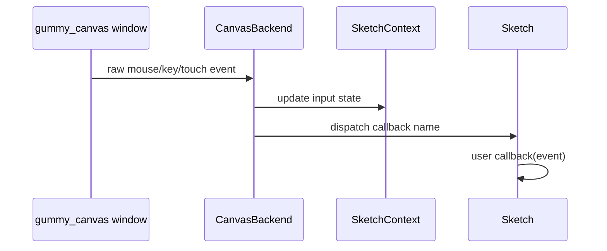

# Runtime Model

The runtime is canvas-first and bounded/headless runs still use `gummy_canvas`.
There is no supported Pillow or Pyglet fallback.

The runtime starts in Python, creates a Python context, and then uses the Rust
canvas runtime for canvas work. Rust can provide native window and input
events, but Python still owns the sketch lifecycle.

## Startup Sequence

`Sketch.run()` performs these high-level steps:

1. Build a backend with `create_backend(headless=...)`.
2. Create `SketchContext(sketch, backend, plugins=...)`.
3. Bind plugin runtime state.
4. Activate the context so global-mode functions can find it.
5. Dispatch `before_preload` plugin hooks.
6. Run user `preload()`.
7. Dispatch `before_setup` plugin hooks.
8. Run user `setup()`.
9. Ensure a canvas exists, creating the default canvas if needed.
10. Dispatch `after_setup` plugin hooks.
11. Ask the backend to run frames.

The key point is that the backend does not call `setup()` or `draw()` directly.
`Sketch` owns callback order; `CanvasBackend` owns runtime execution.

## Frame Order

Keep this ordering intact when changing lifecycle behavior.

## Frame Scheduling

The draw loop checks Gummy Snake lifecycle flags before drawing:

- if `state.looping` is true, draw every scheduled frame
- if `state.redraw_requested` is true, draw one frame even when looping is off
- otherwise skip drawing

`no_loop()` sets `state.looping` false. `loop()` sets it true. `redraw()` marks a
single frame as requested. After a frame is drawn, `redraw_requested` is cleared.

Interactive runs schedule frames according to the target frame rate and poll
native events between frames. Headless bounded runs draw a fixed number of frames
as quickly and deterministically as possible.

## Headless vs Interactive

- `headless=True` or `--headless`: bounded offscreen canvas behavior for tests,
  CI, export, and repeatable scripts.
- `headless=False` or `--interactive`: native interactive behavior when the
  installed runtime supports it.
- Missing canvas runtime or missing native-window support should fail with a
  clear capability error and rebuild guidance.
- A stale or partial canvas runtime should fail during
  `require_canvas_runtime()` if its health check or `CANVAS_ABI_VERSION`
  marker does not match the Python package.

## Input Dispatch

When native input is available, Rust emits window/input events. `CanvasBackend`
polls those events, normalizes them into Python event dataclasses, updates
`SketchContext.state.input`, and then dispatches optional user callbacks.

Input state should always be updated before the user callback runs, so callback
code sees the same values that later Gummy Snake input functions return.

## HiDPI

Gummy Snake separates logical and physical size:

- `width()` and `height()` return logical dimensions.
- `pixel_density()` controls physical backing scale.
- `load_pixels()` and `update_pixels()` operate on physical top-left RGBA
  buffers.

Do not collapse logical and physical dimensions when touching renderer, export,
pixels, image, or input coordinate code.

## Asset, Image, And Pixel Ownership

Rust-managed assets are a performance boundary, not just an implementation
detail. Bulk asset bytes, geometry arrays, parsing, export, projection, metadata
extraction, and future asset processing should stay in `gummy_canvas` whenever
practical. Python wrappers should expose friendly, Pythonic APIs while avoiding
large Python object graphs until user code explicitly asks for them.

`load_image()` keeps a Rust-managed image asset attached to the public `Image`
object until the user asks for mutable pixel behavior. Drawing that untouched
image should use `Canvas.draw_canvas_image()` so repeated sprite draws can reuse
the Rust texture/cache path without another Python byte upload.

`create_image()` and any mutated `Image` use Python-owned RGBA bytes. Each image
has a stable `cache_key` allocated on the `Image` instance; renderer caches must
use that key rather than `id(image)` so Python object-id reuse cannot draw stale
pixels. Image mutations increment `version`, detach any Rust-managed asset, and
force the next draw to upload the changed pixels under the same stable key.

The Rust canvas image and texture caches are bounded. If cache limits are
changed, keep the lifecycle explicit and preserve tests that draw many transient
images.

Image-local bulk operations are also canvas-owned. `Image.resize()`,
`Image.mask()`, supported `Image.filter(...)` modes, crop/copy helpers, and
image alpha compositing delegate their byte work to `gummy_canvas` while Python
keeps public API validation, mutation versioning, and cache-key ownership.

Optional media capture/video helpers remain gated by the `media` extra, but
decoded grayscale, BGR, and BGRA frame conversion to RGBA is routed through
`gummy_canvas` once the media dependency supplies a contiguous frame buffer.

`load_model()` and generated software-3D primitives follow the same ownership
pattern for model assets where the installed canvas runtime supports it. The
public `Model3D` wrapper may retain a Rust-owned `CanvasModel3D` handle for
parsed or generated vertex/index data, while the Python `.meshes` view remains
available and materializes lazily only when user code inspects geometry. `Mesh3D`
itself may retain a Rust-owned `CanvasMesh3D` handle as canonical storage; its
NumPy vertex, normal, texture-coordinate, and packed face-index arrays are lazy
inspection/interchange views over that handle. Hot paths such as OBJ/STL export
and software-3D projection should use Rust handles directly, or NumPy mesh arrays
when no handle is present, instead of forcing repeated Python `Vec3` loops.

`load_sound()` keeps sound bytes and metadata in a Rust-owned `CanvasSound`
handle attached to the public `Sound` wrapper. Python still owns the friendly
playback controls for now, but duration and byte access should flow through the
Rust handle so future decoding, waveform analysis, resampling, and playback work
can happen without first copying sound data into Python-owned structures.

Remaining asset migration candidates are shader sources, font files/outline data,
and large generic byte/data assets. Migrate them when a runtime-owned operation
exists or is planned, such as shader validation/compilation, font outline/model
generation, or binary asset processing. Plain JSON/string helpers can stay
Python-owned until the runtime has a bulk operation that benefits from owning the
bytes.

Optional `gummy_accel` Python fallbacks, such as procedural noise and byte-wise
blend reference kernels, preserve correctness for environments without the
acceleration extension. Treat those Python kernels as reference implementations,
not performance paths for dense animation workloads. Benchmarks should report
whether the Rust acceleration extension handled the measured workload.

## Text And Font Cache Ownership

Rust owns rendered text line caching because it owns font loading, glyph
rasterization, and the texture keys used for GPU text presentation. The rendered
text cache is bounded by entry count and evicts least-recently used entries
before inserting new dynamic text. Eviction also drops the corresponding texture
version bookkeeping so stale texture keys are not reused after a text cache
entry is removed.

The font cache is intentionally process-local to each canvas instance and keyed
by font path. It is bounded by the number of distinct font files a sketch uses;
normal dynamic text changes should not add font entries. If future font-family
resolution starts discovering many paths automatically, add an explicit bound
there too.

Renderer diagnostics expose `text_cache_hits`, `text_cache_misses`,
`text_cache_evictions`, and `text_measurements`. Dynamic counters or labels
should increase misses and eventually evictions without unbounded cache growth.

`load_pixels()` remains the list-based pixel API. `load_pixel_bytes()`
is the lower-copy readback path for effects that can work with bytes, and
`update_pixels()` accepts buffer-like inputs such as `bytes`, `bytearray`, and
`memoryview`.

Canvas region APIs use narrower Rust calls where possible:

- `get(x, y)` reads one physical pixel region and returns `Color`.
- `get(x, y, w, h)` reads only the requested physical region into an `Image`.
- `set(x, y, color)` writes one physical pixel region.
- `set(x, y, image)` uploads and alpha-composites the image region in Rust.
- `filter(...)` applies supported full-canvas filters in Rust without a Python
  `Image` reconstruction.

Full-canvas `get()` and explicit `load_pixels()` still read the full physical
buffer by design.

## WEBGL Runtime Status

`create_canvas(..., WEBGL)` currently uses Rust-backed software projection,
lighting, sorting, OBJ parsing, and fallback rasterization presented through the
2D canvas runtime. It is deterministic and covered by headless tests, but it is
not native accelerated 3D. Backend capabilities therefore distinguish:

- `three_d`: WEBGL mode is accepted.
- `software_three_d`: the Rust-backed software 3D path is available.
- `native_three_d`: the native runtime owns 3D geometry and depth rendering.
- `shaders`: shader-style Python API objects are accepted.
- `native_shaders`: user shader programs are handled by the native renderer.

The canvas backend currently reports `three_d=True`, `software_three_d=True`,
`native_three_d=False`, `shaders=True`, and `native_shaders=False`. See
[`native_3d_plan.md`](native_3d_plan.md) before moving 3D drawing into Rust/GPU
code.

## Canvas Creation And Synchronization

Canvas creation is a cross-layer operation:

1. `SketchContext.create_canvas()` validates the renderer kind and backend
   capability.
2. `CanvasBackend.create_canvas()` forwards the requested logical size and pixel
   density to the renderer.
3. `CanvasRenderer.resize()` asks Rust to allocate or resize the canvas.
4. `SketchContext._sync_canvas_state()` copies renderer dimensions back into
   `SketchState.canvas`.

If a change resizes the canvas but does not synchronize `SketchState.canvas`,
`width()`, `height()`, `pixel_density()`, pixels, export, and input coordinates
can disagree.

## Failure Modes To Preserve

- Missing `gummysnake.rust._canvas` should raise a clear backend capability error.
- Incompatible `gummysnake.rust._canvas` ABI markers should raise a clear backend
  capability error before backend construction proceeds.
- Requesting interactive mode without native-window support should raise a clear
  capability error.
- GPU unavailable diagnostics should explain that headless CPU-backed rendering
  can continue while native presentation or GPU acceleration may be unavailable
  or slower.
- Unsupported renderer names should raise `ArgumentValidationError`.
- Requesting `WEBGL` on a backend without 3D support should raise
  `BackendCapabilityError`.
- Native 3D and native shader support should not be implied by software WEBGL
  capability flags.
- Pixel operations should report capability problems explicitly instead of
  failing with unrelated buffer errors.
