# Synth benchmark semantics

This document is the semantic authority for the replacement synth benchmark
catalogue (`benchmarks/synth_v1.toml`). It prevents a timing baseline from
silently blessing a known rendering or playback defect.

## Ownership and measured boundaries

```mermaid
flowchart LR
    Python[Python composition and lazy values]
    Expand[Physical-plan expansion and validation]
    Serialize[Versioned GSS serialization]
    Bridge[Mandatory canvas PyO3 bridge]
    Compile[Rust compiled synth program]
    DSP[Voices samples FX and output DSP]
    Sink[WAV memory file or SDL queue sink]
    Device[Native SDL audio device]

    Python --> Expand --> Serialize --> Bridge --> Compile --> DSP --> Sink
    Sink --> Device
```



Python owns logical composition, source synth/FX expansion, public argument
validation, and serialization of a bounded physical plan. `gummy_canvas` owns
the PyO3 boundary and maps failures into the established package exception
surface. `gummy_synth` owns physical-plan decode/compile, source/sample DSP,
FX, normalisation, PCM conversion, WAV output, and native audio data supplied to
SDL. Python never schedules individual audio events on a device thread.

Benchmark cases must record the phase they measure. Composition, expansion,
serialization, bridge/compile, DSP, output, queueing, and presentation/device
phases are different measurements and must not be combined under an ambiguous
"render time" label.

## Deterministic plan and control contract

A physical plan is identified by its serialized semantic content, track seed,
and stable plan-local event identity. Equal frame events are ordered by rounded
frame, declared event order, then node identifier. Same-frame controls retain
their declared input order; later controls for the same target/field win.

A target control begins at its rounded target frame. A `*_slide` changes the
value from the value effective at that target frame and uses the documented
sample-rate timeline; it does not begin one frame early. A running source or
shared FX processor must accept controls while its input is silent and while its
tail is draining. A benchmark that only checks controls at event creation does
not qualify the running-control contract.

Event/instance/voice stochastic identity is derived from the track seed and
stable plan-local identifiers. It must not depend on process-global allocation,
previous track builds, worker count, or hash-map iteration order.

## Output and partition policy

There are three comparison levels:

| Policy | Required use | Comparison |
| --- | --- | --- |
| Exact structural | plan expansion and serialization | Exact canonical digest and event/control order |
| Exact PCM | same target, build, source plan, and worker configuration | Byte-identical interleaved PCM/WAV |
| Signal tolerance | different supported native platforms or audio backends | Same frame count, finite samples, channel/routing invariants, and reviewed numerical tolerance |

A true block-partition check renders the same compiled program through different
block partition sequences using persistent source, FX, limiter, and normaliser
state. Slicing an already fully rendered buffer is **not** a block-partition
benchmark and must not be labelled as one.

The causal normaliser contract is versioned separately in
[`synth_normaliser_migration.md`](synth_normaliser_migration.md): it uses fixed
lookahead, linked stereo gain, sample-rate-scaled attack/release, deterministic
finite flush, and no whole-program future peak scan. The historical
whole-buffer global-peak normaliser is non-authoritative and is never a
correctness oracle for a new block-engine baseline.

Finite programs finish only after source and processor tails plus normaliser
latency have drained. Open/rolling programs stay bounded and do not perform a
finite flush until explicitly closed.

## Suite identities and capability rules

- **Offline/headless** cases use the mandatory Canvas/Synth runtime with no
  device requirement. They measure compile, DSP, output, and deterministic
  simulated sink behavior.
- **Simulated realtime** cases use a bounded queue/backpressure simulation with
  the same native DSP engine. They measure block deadline, prefill, queue
  watermark, underrun, stop, and cleanup behavior; they are not native-device
  evidence.
- **Native device** cases require the declared SDL device and exact
  device/system/build fingerprint. Device absence, permission failure, or an
  unsupported format fails the case clearly. It must not select the simulated
  or offline route as a substitute.

All benchmark records must include release provenance for `gummy_synth` and the
Canvas extension. A debug extension or non-release Rust library is not a
comparable performance baseline.

## Metrics

Every case records elapsed and CPU time where supported, throughput, p50/p95/p99
and maximum sample/block time, allocations or RSS where available, cache bytes,
and the phase-specific counters that make the chosen path observable. Streaming
and device cases additionally record first-audio/prefill time, queue high/low
watermarks, underruns, deadline ratio, stop latency, and cleanup completion.

The primary metric remains measured elapsed work for the declared phase. A
counter (for example heartbeat observations) is a correctness diagnostic and
must not be substituted for elapsed time.

## Known defects and non-baseline behavior

The following are defects or incomplete migrations, not accepted output:

- process-history-dependent noise identity;
- unknown primitive/FX/filter/value coercion or silent substitution;
- sample or FX controls ignored after event creation;
- control, tail, limiter, or normaliser differences across true block boundaries;
- Python value stringification or colliding mapping-key coercion;
- implicit packaged-sample lookup and undefined BPM-sensitive timeline behavior;
- unbounded durations, rates, controls, nesting, compressed plans, output, or
  cache allocation;
- a missing device selecting another playback route.

A case exercising an unresolved defect may be catalogued as unavailable with an
explicit reason, but it must not publish a successful baseline or silently run a
different workload.

## Focused commands

```sh
uv run pytest tests/unit/benchmark_system/test_synth_catalog.py -q
uv run pytest tests/unit/benchmark_system/test_synth_dispatch.py -q
uv run pytest tests/unit/benchmark_system/test_synth_coverage.py -q
cargo test --manifest-path crates/gummy_synth/Cargo.toml
```

Use the benchmark runner only with its declared capability/provenance checks;
do not invoke an unavailable device workload as an offline fallback.
