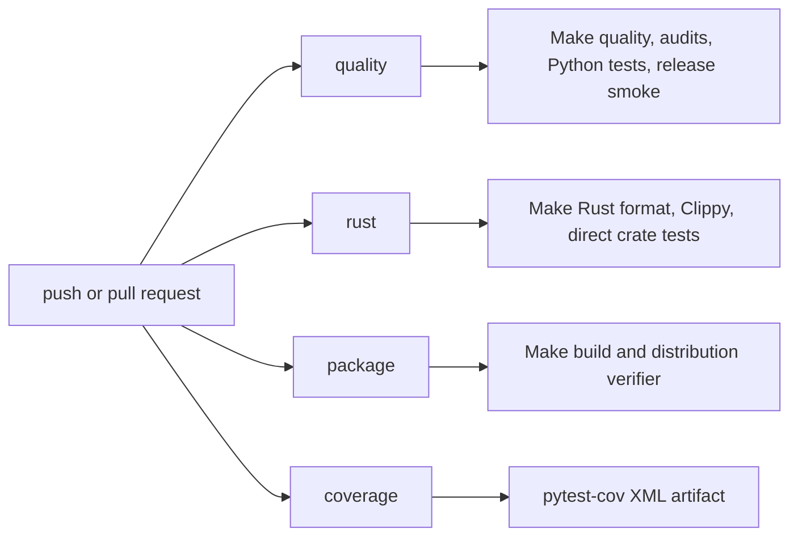

# Testing and CI

Use the smallest checks that cover the change.

## Canonical Commands

The [canonical validation matrix](validation.md) is the source of truth for
local, pull-request, publish, native-wheel, and release-candidate gates. Start
with a release runtime, then run the supported comprehensive local gate:

```sh
uv sync --dev
make runtime-develop-release
make check
```

Useful focused commands remain available without duplicating workflow recipes:

```sh
make format-check
make static-analysis
make repository-audits
make test-focused
make test-full
make rust-check
make smoke-release
make package-verify
```

`make check` and every command above are non-mutating to tracked files. `make
format` intentionally reformats files. `make package-verify` builds into a fresh,
ignored `.scratch/package-verify/run.*` workspace and removes only that workspace
when it finishes; it never inspects or removes shared `dist/` artifacts. The normal
test suite leaves resource stress markers opt-in.

For coverage locally:

```sh
uv run pytest --cov=gummysnake --cov-report=term-missing --cov-report=xml
```

## Choosing The Right Check

Use focused checks while developing, then broaden before handing off:

| Change type | Minimum useful check |
| --- | --- |
| Pure Python API/state logic | targeted `uv run pytest tests/unit/...` |
| Public API export changes | unit tests plus `make static-analysis` |
| Backend scheduling or capability behavior | `tests/contracts/` plus relevant unit tests |
| Renderer or pixel behavior | contract or integration test plus a headless smoke example |
| Rust canvas runtime behavior | `cargo test --manifest-path crates/gummy_canvas/Cargo.toml` plus Python wrapper tests |
| ECS API, storage, scheduling, or physical execution | `uv run ruff check src/gummysnake/ecs tests/unit/ecs/test_ecs.py`, `uv run mypy src/gummysnake/ecs`, `uv run pytest tests/unit/ecs/test_ecs.py -q`, and `cargo test --manifest-path crates/gummy_ecs/Cargo.toml` |
| ECS spatial systems or examples | ECS unit/Rust checks plus `uv run python examples/10_ecs/firefly_constellation.py --headless --frames 1 --no-save`, `uv run python examples/10_ecs/crystal_moths.py --headless --frames 1 --no-save`, or `uv run python examples/09_performance/boids_3d.py --headless --frames 1 --no-save` |
| WEBGL or fallback 3D path behavior | focused integration tests plus a bounded WEBGL smoke example when hot paths change |
| Long-running resource lifecycle behavior | `uv run pytest tests/stress --run-stress -q -s` |
| Static-analysis configuration, suppressions, or tooling | `make static-analysis` plus `uv run pytest tests/unit/tooling/test_static_analysis_audit.py` |
| Examples, catalog, or example smoke tooling | `uv run python scripts/structure_audit.py` and the relevant `scripts/example_smoke.py --tier ...` commands |
| Documentation only | link/path review; no full test suite required unless commands changed |
| Source layout, package naming, file splits, or validation-route moves | `make audit`, `uv run python scripts/source_size_audit.py`, and `uv run python scripts/impact_map_audit.py` |
| Synth or FX asset sources | `make assets-check` plus focused synth asset tests |
| Source distribution/package inputs | `make package-verify` (repeatable and isolated) or `make verify-sdist SDIST_DIR=dist` after building when `dist/` has exactly one matching sdist |
| Built wheel, native stubs, or release packaging | `make verify-wheel WHEEL_DIR=dist/canvas` or `make verify-wheel-accel WHEEL_DIR=dist/canvas ACCELERATED_WHEEL_DIR=dist/accelerated` |
| CI workflow changes | `uv run pytest tests/unit/tooling/test_validation_workflows.py -q` plus Make command equivalence |

## Test Placement

- `tests/unit/`: pure API, state, assets, events, and wrapper behavior, grouped into
  `api_lifecycle/`, `assets_media/`, `canvas_runtime/`, `ecs/`, `synth/`,
  `three_d/`, and `tooling/`.
- `tests/contracts/`: backend and renderer promises.
- `tests/golden/`: deterministic render comparisons.
- `tests/integration/`: end-to-end sketch behavior.
- `tests/stress/`: opt-in long-running resource lifecycle tests.
- `tests/helpers/`: shared fake canvas modules, renderer fakes, WebGL helpers,
  and other reusable test support that should not live under one specific test
  category. Canvas-runtime fakes live in `tests/helpers/canvas_runtime/`; ECS,
  synth, and WEBGL helpers remain reusable top-level helpers.
- `tests/fixtures/`: package-resource and file fixtures used by tests. Do not put
  test-only fixtures under `src/gummysnake`.

## Structure Guardrails

Run these after source-layout changes and before broad validation on refactor
branches:

```sh
uv run python scripts/source_size_audit.py
uv run python scripts/source_size_audit.py --check
uv run python scripts/structure_audit.py
# equivalent enforcement target:
make audit
```

`source_size_audit.py` reports implementation files over the 300-counted-line
review threshold while excluding import/export barrels. Its `--check` mode scans
all Python and Cargo-workspace production roots, including canvas, ECS, synth,
and acceleration crates, then fails on new or enlarged files above the reviewed
500-line enforcement policy. `structure_audit.py` catches confusing Python
module/package sibling patterns, source-package test fixtures, stale renamed
layout references, missing generated-output ignore policy, and undocumented or
stale Rust same-stem hubs, missing local Markdown links, stale current source-path code spans, and
unreviewed support-file prefix clusters across every workspace crate. Run `make assets-check` to
compile source-defined synth/FX assets into temporary outputs and verify packaged `.gss`/`.gsfx`
assets are current without modifying them. `impact_map_audit.py` validates the
maintained [source-to-test impact map](source_test_impact_map.md): every top-level
Python/Rust owner, category decision, named check path, command path, and Cargo
workspace owner must remain current. After `uv build --sdist`, run
`make verify-sdist SDIST_DIR=dist` to discover and verify the one generated
archive, including recursive local Cargo sources and Maturin-included assets. This
direct discovery command deliberately rejects a shared directory with zero or
multiple matching archives; use `make package-verify` for an isolated, repeatable
build-and-verify run.

## Distribution Contracts

`gummysnake` is a typed package: release wheels must contain
`gummysnake/py.typed`, `_canvas.pyi`, and `_accelerated.pyi`. The mandatory
canvas wheel must also contain a native `gummysnake.rust._canvas` extension.
The optional acceleration wheel is verified separately because it is not a
fallback for canvas, ECS, synth, or assets.

Use release-built wheels for the complete contract:

```sh
make build-rust WHEEL_DIR=dist/canvas
make build-accel ACCELERATED_WHEEL_DIR=dist/accelerated
make verify-wheel-accel WHEEL_DIR=dist/canvas ACCELERATED_WHEEL_DIR=dist/accelerated
```

The verifier inspects wheel members, compares every public native module
function’s symbol and runtime signature to its shipped `.pyi` file, then uses
`uv run --isolated` to type-check and execute a consumer installed from the
wheel. That consumer requires canvas ABI 20, ECS ABI 4, health checks, an
empty Rust ECS world, a headless frame, packaged synth/FX/sample lookup, and a
non-empty Rust-rendered WAV. A separate consumer blocks the native extension and
requires the clear rebuild-guidance capability error rather than a Python
fallback. Both consumers reject source-tree imports.

## Performance Investigation

The replacement benchmark system has self-contained Canvas, ECS, and Synth catalogs.
Automated correctness remains part of catalog/schema/oracle tests and bounded headless
smoke. Run every bounded headless correctness case with:

```sh
make benchmark-smoke
```

Performance timing is not a CI or release gate. A maintainer invokes
`scripts/benchmark.py worktree <catalog>` or `record-head <catalog>` manually. Comparable
runs build an isolated release wheel from a verified materialized snapshot, execute
fixed workloads, check deterministic oracles before timing, retain raw samples and path
diagnostics, and write ignored local history keyed by fingerprint and commit. The local
policy fails degradation greater than 5.00% on an exact fingerprint; exactly 5.00%
passes. Native-interactive and native-audio suites are optional manual information and
may be unavailable without blocking completion.

For Rust-executed ECS hot paths, confirm `ecs_physical_system_runs` advances while
`ecs_udf_calls` remains zero. For spatial paths, inspect candidate/exact rows and
per-algorithm counters. Keep bulk pixel mutation in Rust or a Rust/GPU region path
rather than reintroducing Python per-pixel loops.

## Resource Stress Tests

Long-running lifecycle checks live under `tests/stress/` and are skipped unless
explicitly requested:

```sh
make test-stress
```

For release candidates, follow the canonical validation matrix's release-built
functional, smoke, and stress checks.

Run these before releases and when changing canvas resize, shutdown, image
texture caching, text/font caching, pixel readback/upload, direct shape/clip
finalization, ECS spatial index lifecycle, or CPU/GPU route boundaries.
current scenarios churn transient images, dynamic text, repeated pixel
readback/upload, repeated resize, repeated close/recreate, CPU fallback paths,
and ECS spatial storage/index state where those tests are enabled. They assert
cache/counter behavior and basic state consistency; they are not timing acceptance gates.

## Test Style

Prefer deterministic tests:

- Use bounded headless runs with `max_frames` for sketch behavior.
- Include pixel-sampling regressions for renderer ordering bugs, especially text
  before primitives/images followed by later text, primitives after text/images,
  and HiDPI-sensitive fallback paths.
- Use fake canvas modules or fake runtime objects for capability and event edge
  cases.
- Assert public behavior instead of private implementation details when the
  public behavior is stable.
- Use contract tests when multiple backend/renderer implementations would be
  expected to satisfy the same promise.
- Keep slow lifecycle churn behind the explicit stress marker.

Avoid tests that require manual native windows unless the behavior cannot be
reasonably covered headlessly.

## CI Layout



The shared Linux composite action provisions native dependencies for every
Ubuntu job. `quality` invokes the canonical format/static-analysis/audit/version/
asset/focused/full/smoke targets; `rust` invokes `make rust-check`; and
`package` invokes `make package-verify`. Coverage is reported in the job summary
and uploaded as `coverage-xml`.

Publish repeats those same validation gates, then builds and runs the installed
wheel smoke on each wheel's Linux, macOS Intel, macOS ARM, or Windows builder.
The optional manual publish `release_candidate` input invokes the documented
release-candidate validation flow; resource stress checks are otherwise never
silently promoted into ordinary CI.

## Coverage Reporting

The coverage job intentionally reports coverage without enforcing a threshold.
That makes coverage visible without blocking unrelated maintenance work. Add a
threshold only after the project has agreed on a baseline and exclusion policy.

## Backlog TOML

If you edit backlog items, preserve the existing `priority` key spelling and
validate the files:

```sh
uv run python -c "from pathlib import Path; import tomllib; [tomllib.load(p.open('rb')) for p in sorted(Path('.scratch/backlog').glob('**/*.toml'))]; print('Backlog TOML parsed successfully')"
```
